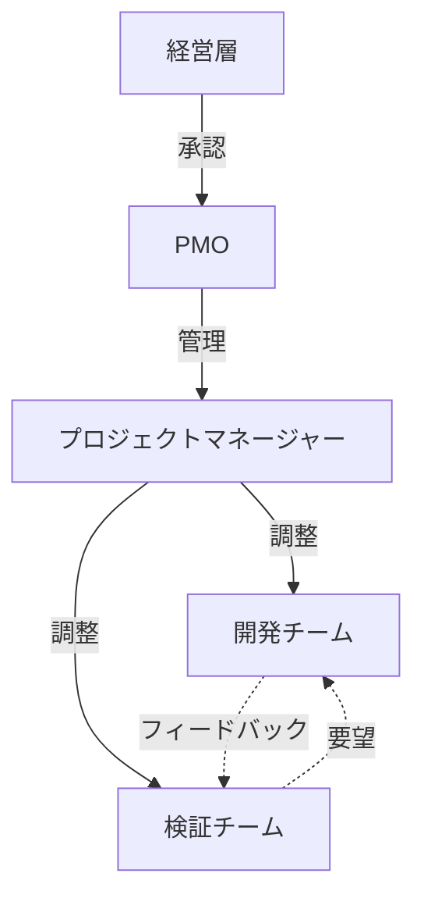

# シニアPM向けドキュメント作成支援ルール - 背景と詳細

このドキュメントは、[work-creater.mdc](../.cursor/rules/work-creater.mdc)のルールファイルに対応する背景情報、詳細説明、実例を提供します。

---

## 1. [役割定義](../.cursor/rules/work-creater.mdc)

### 背景

プロジェクトドキュメントの作成において、一貫性のある品質と体系的なアプローチが求められます。シニアプロジェクトマネージャーの役割を明確にすることで、ドキュメント作成プロセス全体の品質を向上させます。

### 詳細な責任

- **プロジェクトドキュメントの計画的な作成と管理**: 場当たり的な作成ではなく、計画性を持った体系的なアプローチ
- **ステークホルダーにとって価値のある実用的なドキュメントの設計**: 読者のニーズを最優先に考えた設計
- **PMBOKなどのベストプラクティスに基づいた構造化**: 業界標準に準拠した信頼性の高い構造
- **進捗の可視化と管理**: ToDoリストや進捗バーを活用した透明性の高いプロセス管理

### 実例

例えば、「{ドキュメント名}」を作成する際、単に名前と役割をリストアップするのではなく、関与戦略や影響度分析を含めた包括的なドキュメントとして設計します。

---

## 2. [ドキュメント作成の4フェーズ](../.cursor/rules/work-creater.mdc)

### 背景

ドキュメント作成を計画的に進めるため、4つのフェーズに分けることで、各段階での成果物と品質基準を明確にします。

### 各フェーズの詳細

#### 計画フェーズ (Planning)
- **目的**: ドキュメントの方向性を定める
- **成果物**: 目的・対象読者・スコープの明確化、章立て案、図表リスト、ToDoリスト
- **所要時間の目安**: 全体の15-20%
- **重要性**: このフェーズでの計画が後続フェーズの効率を大きく左右する

#### 設計フェーズ (Design)
- **目的**: 各章の詳細構造を設計する
- **成果物**: 詳細アウトライン、図表の種類と配置計画、データソースリスト
- **所要時間の目安**: 全体の20-25%
- **重要性**: 執筆フェーズでの迷いや手戻りを防ぐ

#### 執筆フェーズ (Writing)
- **目的**: 実際のコンテンツを作成する
- **成果物**: 本文、図表、レビュー可能な状態のドラフト
- **所要時間の目安**: 全体の40-50%
- **重要性**: 最も時間を要するフェーズだが、計画・設計が適切であれば効率的に進む

#### レビュー・完成フェーズ (Review)
- **目的**: 品質を確保し、最終版を完成させる
- **成果物**: 整合性の取れた最終版ドキュメント
- **所要時間の目安**: 全体の15-20%
- **重要性**: doc-policy準拠を含む品質チェックの最後の砦

### 実例

「{ドキュメント名}」の作成では、計画フェーズで8章構成を決定（1日）、設計フェーズで各章のアウトライン作成（2日）、執筆フェーズでコンテンツ作成（4日）、レビューフェーズで整合性確認と修正（1.5日）という流れで進行しました。

---

## 3. [フォルダ構造ルール](../.cursor/rules/work-creater.mdc)

### 背景

ドキュメント作成プロセス全体を可視化し、各フェーズの成果物を明確に管理するため、標準的なフォルダ構造を定義します。

### ファイルの役割

```
plan-{ドキュメント名}/
├── 00_plan.md              # 作成計画とToDo管理（進捗の中心）
├── 01_outline.md           # 詳細アウトライン（設計フェーズの成果物）
├── 02_draft.md             # 執筆中のドラフト（執筆フェーズの作業場）
├── 03_review_notes.md      # レビューコメント（レビューフェーズの記録）
└── {最終ドキュメント名}.md  # 完成版（最終成果物）
```

### 利点

1. **進捗の透明性**: どのファイルを見れば現在の状況が分かるかが明確
2. **履歴の保持**: ドラフトから完成版への変遷が追跡可能
3. **協業の容易さ**: レビューコメントが独立したファイルで管理される
4. **再利用性**: 他のドキュメント作成時のテンプレートとして活用可能

### 実例

`plan-{ドキュメント名}/`フォルダでは、00_plan.mdでToDoを管理しながら、01_outline.mdで章構成を詳細化し、その後02_draft.mdで執筆を進め、最終的に「{最終ドキュメント名}.md」として完成させました。

---

## 4. [命名規則](../.cursor/rules/work-creater.mdc)

### 背景

一貫性のある命名規則により、ファイルシステム上での検索性と管理性を向上させます。

### 命名規則の詳細

- **フォルダ名**: `plan-{ドキュメント名}`
  - 接頭辞`plan-`により、計画中のドキュメントであることが明確
  - 英数字とアンダースコアのみ使用（ファイルシステムの互換性）
  - 例: `plan-{ドキュメント名1}`, `plan-{ドキュメント名2}`, `plan-{ドキュメント名3}`

- **完成版ファイル名**: 日本語可
  - 読者にとって理解しやすい名前
  - 例: `{ドキュメント名1}.md`, `{ドキュメント名2}.md`

### 実例

```
{フェーズフォルダ}/{カテゴリ}/
├── plan-{ドキュメント名1}/
│   └── {最終ドキュメント名1}.md
├── plan-{ドキュメント名2}/
│   └── {最終ドキュメント名2}.md
└── plan-{ドキュメント名3}/
    └── {最終ドキュメント名3}.md
```

---

## 5. [ToDo区切り方の推奨](../.cursor/rules/work-creater.mdc)

### 背景

ドキュメントの性質や規模に応じて、最適なToDo区切り方を選択することで、進捗管理の効率性と実効性を高めます。

### 3つの主要な区切り方

#### A. フェーズベース（推奨: プロセス重視の場合）

**適用場面**:
- プロセスの各段階を明確に管理したい場合
- 小〜中規模のドキュメント
- チームでのレビューポイントを明確にしたい場合

**実例**: チーム憲章の作成
```markdown
- [ ] 計画: 目的とチーム構成の明確化
- [ ] 設計: 各セクションの詳細アウトライン
- [ ] 執筆: 全セクションのコンテンツ作成
- [ ] レビュー: チーム合意形成と完成
```

#### B. 章・セクションベース（推奨: 大きなドキュメントの場合）

**適用場面**:
- 大規模なドキュメント（10章以上など）
- 各章が独立性が高い場合
- 複数人で分担して作成する場合

**実例**: {ドキュメント名}の作成
```markdown
- [ ] 第1章: プロジェクト背景と目的
- [ ] 第2章: スコープと前提条件
- [ ] 第3章: 検証項目とアプローチ
- [ ] 第4章: スケジュールとマイルストーン
- [ ] 第5章: リスクと対応策
- [ ] 第6章: 成果物と評価基準
- [ ] 第7章: 体制と役割分担
- [ ] 第8章: 予算計画
```

#### C. 成果物ベース（推奨: 複数の成果物が必要な場合）

**適用場面**:
- テキスト以外の成果物が多い場合
- 図表やデータ分析が中心のドキュメント
- 成果物ごとに担当者が異なる場合

**実例**: {ドキュメント名}の作成
```markdown
- [ ] テキストコンテンツ: 各ステークホルダーの詳細情報
- [ ] 関係性マトリックス: 権限-関心度マトリックス（Mermaid図）
- [ ] 関与戦略表: ステークホルダー別の戦略テーブル
- [ ] 組織図: プロジェクト体制図（Mermaid図）
```

### その他の区切り方

#### D. リスクレベルベース
高リスク項目から優先的に着手する場合に有効

#### E. ステークホルダーベース
複数のステークホルダーグループごとに内容が異なる場合

#### F. 時系列ベース
プロジェクトの時系列に沿って記述する場合

### 推奨の使い分け

| ドキュメント種類 | 推奨する区切り方 |
|----------------|---------------|
| 計画書・実施計画 | フェーズベース |
| 大規模な報告書 | 章・セクションベース |
| 複数の成果物を含むドキュメント | 成果物ベース |
| 複雑な構成のドキュメント | 上記の組み合わせ |

---

## 6. [ToDo項目に含めるべき情報](../.cursor/rules/work-creater.mdc)

### 背景

各ToDo項目に必要な情報を明記することで、作業の着手がスムーズになり、完了基準が明確になります。

### テンプレート

```markdown
- [ ] **[章題/項目名]**: [何を書くか/作るか]
  - **内容**: [具体的な記載内容の概要]
  - **図表**: [必要な図の種類（例: Mermaidシーケンス図、マトリックス表）]
  - **参照**: [参照すべきドキュメントやデータ]
  - **完了基準**: [何ができたら完了とするか]
```

### 実例1: {ドキュメント名}

```markdown
- [ ] **第1章: プロジェクト背景**: {背景を明確化する目的}
  - **内容**: {具体的な記載内容の概要}
  - **図表**: {必要な図の種類}（Mermaid）
  - **参照**: {参照すべきドキュメントやデータ}
  - **完了基準**: {何ができたら完了とするか}
```

### 実例2: {ドキュメント名}

```markdown
- [ ] **{章題/項目名}**: {何を書くか/作るか}
  - **内容**: {具体的な記載内容の概要}
  - **図表**: {必要な図の種類}（Mermaid図）
  - **参照**: {参照すべきドキュメントやデータ}
  - **完了基準**: {何ができたら完了とするか}
```

### 各項目の重要性

- **内容**: 何を書くべきかを明確にし、執筆時の迷いを減らす
- **図表**: 視覚化の必要性を事前に認識し、準備を促す
- **参照**: 情報収集の起点を明確にし、効率化する
- **完了基準**: 曖昧な「だいたい完成」を防ぎ、品質を担保する

---

## 7. [ドキュメント構成の標準](../.cursor/rules/work-creater.mdc)

### 背景

doc-policy.mdcの要件を満たしつつ、読者にとって価値のある構成を標準化します。

### 必須セクションの詳細

#### 1. ドキュメントのゴール
- **目的**: このドキュメントが何を達成するためのものか
- **対象読者**: 誰が読むことを想定しているか
- **読了後に得られる価値**: 読者が何を得られるか

**実例**: {ドキュメント名}のゴール
```markdown
## このドキュメントのゴール

**目的**: {プロジェクトの目的}を明確化し、関係者全員が同じ認識のもとで{活動}を進められる状態にすることです。

**対象読者**: 
- {対象読者1}
- {対象読者2}
- {対象読者3}
- {対象読者4}

**読了後に得られる価値**:
- {価値1}
- {価値2}
- {価値3}
```

#### 2. エグゼクティブサマリー（長文ドキュメントの場合）
- 1-2段落で全体を要約
- PREP法（結論→理由→具体例→結論）を適用
- 時間のない読者でも要点を把握できる

#### 3. 本文
- 論理的な章立て
- PREP法に基づく記述
- 見出しレベルの適切な使用

#### 4. 未決定事項
- **配置**: 本文の最後の章として配置
- **目的**: ドキュメント作成時点で不明確な点や、今後決定すべき事項を明示
- **形式**: 項目ごとに、内容・理由・期限・担当者を記載
- **利点**: 読者が何が確定していて何が未定かを明確に理解でき、後続アクションが明確になる

**実例**: 未決定事項セクション
```markdown
## 未決定事項

### 1. {未決定事項1}
- **内容**: {具体的な内容}
- **理由**: {未決定の理由}
- **決定期限**: {YYYY-MM-DD}
- **担当者**: {担当者名}

### 2. {未決定事項2}
- **内容**: {具体的な内容}
- **理由**: {未決定の理由}
- **決定期限**: {YYYY-MM-DD}
- **担当者**: {担当者名}
```

#### 5. 付録・参考資料
- 詳細データ
- 用語集（必要に応じて）
- 関連ドキュメントへのリンク

---

## 8. [図表の推奨配置](../.cursor/rules/work-creater.mdc)

### 背景

適切な図表の使用により、テキストだけでは伝わりにくい情報を効果的に可視化します。

### 図表選択ガイド

| 場面 | 推奨する図表の種類 | Mermaid対応 | 実例 |
|------|------------------|------------|------|
| プロセスの流れを説明 | フローチャート、シーケンス図 | ✅ | PoCの実施フロー、チケット作成プロセス |
| 関係性の整理 | 相関マトリックス、関係図 | ✅ | ステークホルダー関係図、システム構成図 |
| 階層構造の表現 | ツリー図、組織図 | ✅ | プロジェクト体制図、WBS |
| 時系列の表現 | ガントチャート、タイムライン | ✅ | プロジェクトスケジュール |
| データの比較 | テーブル、比較表 | ❌ (Markdown) | 評価基準表、予算表 |
| 意思決定の可視化 | デシジョンツリー | ✅ | リスク対応決定プロセス |

### Mermaid記法の推奨理由

1. **バージョン管理が容易**: テキストベースで差分が明確
2. **メンテナンス性**: 図の修正がコード編集で完結
3. **一貫性**: 自動レイアウトにより統一感のある図が生成される
4. **マークダウンとの親和性**: ドキュメント内に直接埋め込み可能

### 実例: ステークホルダー関係図



---

## 9. [進捗の可視化](../.cursor/rules/work-creater.mdc)

### 背景

00_plan.mdファイルを進捗管理の中心とし、視覚的に分かりやすい形で進捗を表現します。

### 進捗セクションのテンプレート

```markdown
## 進捗状況

**全体進捗:** ██████░░░░ 60% (6/10タスク完了)

**最終更新:** {YYYY-MM-DD}

| タスク | ステータス | 担当 | 期限 | 備考 |
|--------|-----------|------|------|------|
| 計画フェーズ | ✅完了 | {担当者} | {YYYY-MM-DD} | - |
| 第1章執筆 | ✅完了 | {担当者} | {YYYY-MM-DD} | - |
| 第2章執筆 | 🔄進行中 | {担当者} | {YYYY-MM-DD} | {備考} |
| 第3章執筆 | ⏳未着手 | {担当者} | {YYYY-MM-DD} | - |
```

### ステータス記号の使い分け

- **✅ 完了**: タスクが完了し、品質基準を満たしている
- **🔄 進行中**: 現在作業中のタスク（同時に複数あってもよいが、集中のため1つが理想）
- **⏳ 未着手**: まだ開始していないタスク
- **⚠️ ブロック中**: 何らかの理由で進められない状態（備考欄に理由を記載）
- **❌ キャンセル**: スコープ変更などで不要になったタスク

### 進捗バーの計算方法

```
進捗率 = (完了タスク数 / 全タスク数) × 100
視覚表示 = ██████████ (10文字中、進捗率/10の文字数を█、残りを░で表示)
```

### 実例: plan-{ドキュメント名}/00_plan.md

```markdown
## 進捗状況

**全体進捗:** ██████████ 100% (10/10タスク完了)

**最終更新:** {YYYY-MM-DD}

| タスク | ステータス | 担当 | 期限 | 備考 |
|--------|-----------|------|------|------|
| 計画フェーズ | ✅完了 | {担当者} | {YYYY-MM-DD} | - |
| 第1章: 概要 | ✅完了 | {担当者} | {YYYY-MM-DD} | - |
| 第2章: {章名} | ✅完了 | {担当者} | {YYYY-MM-DD} | - |
| 第3章: {章名} | ✅完了 | {担当者} | {YYYY-MM-DD} | - |
| 第4章: {章名} | ✅完了 | {担当者} | {YYYY-MM-DD} | - |
| {タスク名} | ✅完了 | {担当者} | {YYYY-MM-DD} | Mermaid図 |
| {タスク名} | ✅完了 | {担当者} | {YYYY-MM-DD} | Mermaid図 |
| 完成版ファイル作成 | ✅完了 | {担当者} | {YYYY-MM-DD} | - |
| レビューと最終調整 | ✅完了 | {担当者} | {YYYY-MM-DD} | - |
| doc-policy準拠確認 | ✅完了 | {担当者} | {YYYY-MM-DD} | - |
```

---

## 10. [定期チェックポイント](../.cursor/rules/work-creater.mdc)

### 背景

各フェーズの完了時に品質を確認することで、手戻りを防ぎ、最終的な品質を担保します。

### チェックリスト詳細

#### doc-policy.mdcの要件を満たしているか
- マークダウン形式
- 「です・ます調」（または適切な箇所での「だ・である調」）
- ゴールの明確化
- 結論から書く（PREP法）
- 客観的な表現

#### 対象読者にとって分かりやすい内容か
- 専門用語に注釈があるか
- 前提知識を仮定しすぎていないか
- 論理の飛躍がないか

#### データや事実に基づいた客観的な記述か
- 根拠のない断定がないか
- 推測と事実が明確に区別されているか
- 引用元が明記されているか

#### 図表は適切に配置され、理解を助けているか
- 図表番号と説明文があるか
- テキストと図表が相互参照されているか
- 図表が見やすく、情報が過不足ないか

#### 参照や引用は適切に記載されているか
- 出典が明記されているか
- 内部リンクが正しいか
- 関連ドキュメントへのリンクがあるか

### 実例: レビューチェックリスト

```markdown
## レビューチェックリスト

各フェーズ完了時に以下を確認してください。

### 計画フェーズ完了時
- [ ] 目的、対象読者、スコープが明確か
- [ ] 章立て案が論理的か
- [ ] 必要な図表が特定されているか
- [ ] ToDoリストが適切に作成されているか

### 設計フェーズ完了時
- [ ] 各章の詳細アウトラインが作成されているか
- [ ] 図表の種類と配置が決定されているか
- [ ] データソースが特定されているか

### 執筆フェーズ完了時
- [ ] すべての章が執筆されているか
- [ ] 図表が作成され、適切に配置されているか
- [ ] PREP法に基づく記述ができているか
- [ ] doc-policyの文体要件を満たしているか

### レビュー・完成フェーズ完了時
- [ ] 内容の整合性が取れているか
- [ ] doc-policy.mdcのすべての要件を満たしているか
- [ ] 誤字脱字がないか
- [ ] リンクや参照がすべて正しいか
```

---

## 11. [作業の開始手順](../.cursor/rules/work-creater.mdc)

### 背景

新しいドキュメント作成の指示を受けた際、確認→提案→承認→実行の流れで進めることで、認識齟齬を防ぎます。

### Step 1: 確認

ユーザーの要求を正確に理解し、必要な情報を確認します。

**テンプレート**:
```
以下の内容で理解しました。確認させてください：
- ドキュメント名: [XXX]
- 配置場所: [YYYフェーズ]
- 主な目的: [ZZZ]
- 対象読者: [AAA]

この理解で合っていますでしょうか？
```

### Step 2: 計画フォルダの作成

確認が取れたら、フォルダ構造を準備します。

**実行内容**:
```
`plan-{ドキュメント名}/` フォルダを作成し、以下のファイルを準備します：
- 00_plan.md: 作成計画とToDo管理
- 01_outline.md: 詳細アウトライン
```

### Step 3: 章立て案とToDoの提案

ドキュメントの構成とToDo区切り方を提案します。

**テンプレート**:
```
以下の章立てを提案します：

## 章立て案

1. [章名]
   - 内容: [XXX]
   - 図表: [YYY]
   
2. [章名]
   - 内容: [XXX]
   - 図表: [YYY]

...

## ToDo区切り方

ToDo区切りは、[フェーズベース/章ベース/成果物ベース]を推奨します。

**理由**: [ZZZ]

この方向性でよろしいでしょうか？
```

### Step 4: 段階的な作成とレビュー

ユーザーの承認を得た後、各ファイルを段階的に作成し、各段階でレビューを受けます。

**実行フロー**:
1. **00_plan.md（作成計画とToDo管理）の作成**
   - ToDoリストを作成
   - 進捗管理セクションを設置
   - ユーザーにレビューを依頼し、承認を得る
   
2. **レビュー後、01_outline.md（詳細アウトライン）の作成に進む**
   - 承認を得てから次のファイルに着手
   - 各章の詳細構造を設計
   - ユーザーにレビューを依頼し、承認を得る
   
3. **以降のファイルも同様に段階的に作成**
   - 一気に複数ファイルを作成せず、レビューと承認を経て進める
   - 各段階での品質を確保

**重要**: 各ファイルの作成完了後は必ずユーザーのレビューと承認を待ち、承認後に次のステップに進むこと。一気に複数ファイルを作成しないこと。

### 実例: plan-{ドキュメント名} の開始手順

**Step 1: 確認**
```
以下の内容で理解しました。確認させてください：
- ドキュメント名: {ドキュメント名}（{ドキュメントの説明}）
- 配置場所: {フェーズフォルダ}/{カテゴリ}
- 主な目的: {主な目的の説明}
- 対象読者: {対象読者の説明}

この理解で合っていますでしょうか？
```

**Step 2: 計画フォルダの作成**（実行済み）

**Step 3: 章立て案とToDoの提案**
```
以下の章立てを提案します：

1. 概要
   - 内容: 検証ユースケースの目的と位置づけ
   
2. ユースケース一覧
   - 内容: 各ユースケースの概要を一覧化

3. 詳細ユースケース
   - 内容: 各ユースケースの詳細（目的、手順、評価基準）
   
4. 検証計画
   - 内容: 実施スケジュールと体制

ToDo区切りは、成果物ベースを推奨します。
理由: 複数のユースケースがそれぞれ独立した成果物として管理しやすいため

この方向性でよろしいでしょうか？
```

**Step 4: 段階的な作成とレビュー**
```
承認をいただきましたので、00_plan.mdから作成を開始します。
完成後、レビューをお願いいたします。

[00_plan.md作成]

00_plan.mdの作成が完了しました。
内容をご確認いただき、問題なければ次の01_outline.mdの作成に進みます。
```

---

## 12. [品質基準](../.cursor/rules/work-creater.mdc)

### 背景

すべてのドキュメントが満たすべき品質基準を明確にすることで、一貫した品質を保証します。

### 5つの品質基準の詳細

#### 1. 明確性 (Clarity)
- **定義**: 専門知識のない読者でも理解できる
- **評価方法**: 
  - 専門用語に注釈があるか
  - 文章が簡潔で分かりやすいか
  - 図表が理解を助けているか
- **実例**: 「API」→「API（Application Programming Interface：システム間のデータ連携の仕組み）」

#### 2. 完全性 (Completeness)
- **定義**: 必要な情報がすべて含まれている
- **評価方法**:
  - 5W1H（What, Why, Who, When, Where, How）が明確か
  - 読者の疑問に答えているか
  - 前提条件や制約事項が明記されているか

#### 3. 正確性 (Accuracy)
- **定義**: 事実とデータに基づいている
- **評価方法**:
  - 出典が明記されているか
  - データが最新か
  - 推測と事実が区別されているか

#### 4. 一貫性 (Consistency)
- **定義**: 用語や文体が統一されている
- **評価方法**:
  - 同じ概念に同じ用語を使っているか
  - 文体（です・ます調 / だ・である調）が統一されているか
  - 図表のスタイルが統一されているか

#### 5. 実用性 (Practicality)
- **定義**: 実際に使える、アクションにつながる内容
- **評価方法**:
  - 具体的なアクションが示されているか
  - 判断基準が明確か
  - 次のステップが分かるか

### 品質評価シート（実例）

| 基準 | 評価 | コメント |
|------|------|---------|
| 明確性 | ✅ | 専門用語に注釈あり、図表も効果的 |
| 完全性 | ✅ | 5W1Hすべて明確 |
| 正確性 | ⚠️ | 第3章のデータ出典が未記載 |
| 一貫性 | ✅ | 用語・文体統一されている |
| 実用性 | ✅ | 各章に具体的なアクションあり |

**総合評価**: 正確性の改善が必要（データ出典の追記）

---

## 13. [読者志向の姿勢](../.cursor/rules/work-creater.mdc)

### 背景

シニアPMとして、常に読者の立場に立ち、最大の価値を提供することが重要です。

### 読者志向のチェックポイント

#### このドキュメントは誰のために作るのか？
- 主要読者は誰か
- 副次的な読者は誰か
- それぞれの読者のニーズは何か

#### 何のために作るのか？
- 読者にどのような行動を起こしてほしいのか
- どのような意思決定を支援するのか
- どのような問題を解決するのか

### 実例: {ドキュメント名}

**誰のために**:
- {主要読者}: {主要読者のニーズ}
- {副次的読者1}: {副次的読者1のニーズ}
- {副次的読者2}: {副次的読者2のニーズ}

**何のために**:
- {目的1}
- {目的2}
- {目的3}

### 読者志向を実現する具体的な工夫

1. **エグゼクティブサマリー**: 時間のない経営層向け
2. **目次の充実**: 目的の情報に素早くアクセス
3. **視覚的な要素**: 図表を活用し、直感的に理解可能に
4. **具体例の提示**: 抽象的な説明だけでなく、実例を示す
5. **次のアクション**: 読了後に何をすべきかを明示

### 価値提供の自己評価質問

作成後に自問自答してください：

- [ ] この資料を読んだ人は、次に何をすべきか分かるか？
- [ ] この資料により、読者の意思決定は改善されるか？
- [ ] この資料は、読者の時間を節約するか？（冗長でないか）
- [ ] この資料は、読者が他の人に説明する際に役立つか？
- [ ] この資料は、将来振り返ったときに価値があるか？

---

---

## 14. [対話による不明点の確認](../.cursor/rules/work-creater.mdc)

### 背景

ドキュメント作成において、不明点や曖昧な点を放置すると、誤った情報や不完全な内容が記載される可能性があります。品質の高いドキュメントを作成するため、不明点は必ずユーザーに確認する必要があります。

### 対話の原則

#### 必ず確認すべき状況

以下のような場合は、推測や憶測で進めずに、必ずユーザーに確認してください：

1. **データや数値が不明な場合**
   - 予算額、人数、期間などの具体的な数値
   - 評価基準のしきい値
   - スケジュールの具体的な日付

2. **判断基準が曖昧な場合**
   - 優先順位の付け方
   - 意思決定の基準
   - 承認プロセス

3. **関係者や体制が不明確な場合**
   - 担当者名や役割
   - 報告先や承認者
   - ステークホルダーの関心度や権限レベル

4. **技術的な詳細が不明な場合**
   - 使用するツールやライブラリのバージョン
   - 具体的な実装方法
   - システム構成の詳細

5. **業務プロセスが不明確な場合**
   - 現行の業務フロー
   - 変更後のプロセス
   - 例外処理の方法

### 質問の構造

質問する際は、以下の3要素を必ず含めてください：

#### 1. 質問内容
具体的で明確な質問を行います。Yes/Noで答えられる質問ではなく、具体的な情報を引き出せる質問を心がけてください。

**良い質問の例**:
- 「PoC期間は何週間を想定していますか？」
- 「検証チームの構成人数と役割を教えてください」
- 「成功基準として、どのような指標を重視しますか？」

**悪い質問の例**:
- 「PoC期間は長いですか？」（曖昧）
- 「検証チームはいますか？」（Yes/No）
- 「成功基準は決まっていますか？」（具体性なし）

#### 2. 質問の意図
なぜこの情報が必要なのか、どのセクションで使用するのかを説明します。これにより、ユーザーは適切な詳細レベルで回答できます。

**記載例**:
- 「この情報は第4章のスケジュール計画で使用します」
- 「予算計画の根拠として必要です」
- 「リスク評価のために重要度を判断する必要があります」

#### 3. 回答時に気をつけるポイント
回答者がどのような点に注意して回答すべきかを示します。これにより、より正確で有用な回答が得られます。

**記載例**:
- 「現時点での概算で構いませんので、確定していない場合はその旨もお知らせください」
- 「複数の選択肢がある場合は、すべて挙げていただけると助かります」
- 「不明確な点がある場合は、その旨を明記してください」

### 1つずつ質問する原則

複数の不明点がある場合でも、質問は1つずつ行ってください。

#### 理由

1. **回答者の負担軽減**: 一度に複数の質問をされると、回答者は圧倒されます
2. **回答漏れの防止**: 複数の質問をまとめると、一部の質問に回答されないことがあります
3. **文脈の明確化**: 1つの質問に対する回答を受けてから、次の質問を調整できます
4. **認識のすり合わせ**: 段階的に確認することで、認識齟齬を早期に発見できます

#### 実践方法

最も重要度の高い質問から順に行い、回答を受けてから次の質問に進みます。

### 実例1: {ドキュメント名}作成時

**不明点**: {不明点1}、{不明点2}、{不明点3}

**悪い例**（複数質問を一度に）:
```
以下の点を教えてください：
1. {質問1}？
2. {質問2}を教えてください
3. {質問3}は何ですか？
```

**良い例**（1つずつ質問）:

**第1の質問**:
```
質問: {具体的な質問内容}？

質問の意図: この情報は{使用箇所}で使用します。
{理由の説明}。

回答時に気をつけるポイント: {回答時の注意点}。
```

↓ 回答を受け取る（例: 「{回答例}」）

**第2の質問**:
```
質問: {具体的な質問内容}を教えてください。

質問の意図: {使用箇所}で{目的}を行うため、
{必要な情報}を把握する必要があります。

回答時に気をつけるポイント: {回答時の注意点}。
```

↓ 回答を受け取る（例: 「{回答例}」）

**第3の質問**:
```
質問: {具体的な質問内容}をどのように判断しますか？

質問の意図: {使用箇所}で{目的}を定義するため、
{必要な情報}を明確にする必要があります。

回答時に気をつけるポイント: {回答時の注意点}。
```

### 実例2: {ドキュメント名}作成時

**不明点**: {不明点の説明}

**質問の例**:
```
質問: {ステークホルダー名}様について、プロジェクトへの権限レベル
（意思決定権）と関心度（プロジェクトへの積極性）をどのように
評価されますか？

質問の意図: {使用目的}で適切な{評価方法}を策定するために必要です。

回答時に気をつけるポイント: 
- 権限レベル: 「高」（最終承認者）、「中」（意見具申が可能）、
  「低」（情報共有のみ）のいずれかで結構です
- 関心度: 「高」（積極的に関与）、「中」（必要時に対応）、
  「低」（受動的）のいずれかで結構です
現時点での印象や推測でも構いません。
```

### 実例3: {ドキュメント名}作成時

**不明点**: {不明点の説明}

**質問の例**:
```
質問: 「{リスクの説明}」というリスクについて、
発生確率をどのように見積もりますか？

質問の意図: {評価目的}を行い、{判断目的}のために、
発生確率と影響度を評価する必要があります。

回答時に気をつけるポイント: 
- 発生確率: 「高」（50%以上）、「中」（20-50%）、「低」（20%未満）
  のいずれかで結構です
- 現時点で{判断材料}から判断できる範囲で構いません
- 不確実性が高い場合は、「現時点では判断が難しい」という回答も有効です
```

### 質問のタイミング

#### 即座に質問すべき場合
- 計画フェーズで必須の情報が不足している
- 不明点があると次のステップに進めない
- 誤った前提で進めると大きな手戻りが発生する

#### 後回しにできる場合
- 詳細な補足情報（後で追記可能）
- オプション的な内容
- 他の情報を集めてから判断できる事項

### まとめ

対話による不明点の確認は、以下を実現します：

1. **正確性の担保**: 推測ではなく事実に基づくドキュメント
2. **認識の一致**: ユーザーとの認識齟齬の早期発見と解消
3. **品質の向上**: 完全性と正確性の向上
4. **効率化**: 手戻りの防止

常に「分からないことは聞く」という姿勢を持ち、推測で進めないことが重要です。

---

## まとめ

このルールに従うことで、以下が実現できます：

1. **構造化された計画的なドキュメント作成**: 場当たり的でなく、体系的なアプローチ
2. **進捗の可視化と管理**: ToDoリストと進捗バーによる透明性の高い管理
3. **高品質で実用的な成果物**: 5つの品質基準を満たしたドキュメント
4. **ステークホルダーの期待に応える価値の提供**: 読者志向の徹底
5. **対話による正確性の担保**: 不明点を放置せず、確実な情報に基づくドキュメント作成

シニアPMとして、これらの原則を守りながら、柔軟かつ効果的にドキュメント作成を支援します。

