# シーケンス図作成ルール - 背景資料

本資料は、[sequence_create.mdc](../rules/sequence_create.mdc)のルールを策定するに至った経緯、背景、実例を説明するものです。

---

## 1. [シーケンス図作成のインプット情報は、`output`ディレクトリ内のファイル（code_analysis_report.md、clang_tidy_report.txt、source_code_syntax_tree.mdなど）を参照すること](../rules/sequence_create.mdc)

### 背景・理由

シーケンス図を作成する際は、実際のコード分析結果に基づく必要があります：

- **正確性の確保**: コードベースの実際の構造や処理フローを反映することで、誤った理解に基づく図を避けられる
- **一貫性の維持**: 同じインプットソースから生成することで、複数のシーケンス図間で整合性が保たれる
- **トレーサビリティ**: どの分析結果に基づいて図を作成したかを明確にすることで、後から検証や更新が容易になる

### 実例

- `code_analysis_report.md`: コード全体の構造分析結果
- `clang_tidy_report.txt`: 静的解析ツールによるコード品質レポート
- `source_code_syntax_tree.md`: AST（抽象構文木）に基づくコード構造の詳細

---

## 2. [シーケンス図はMermaid記法で作成し、sequenceDiagram構文を使用すること](../rules/sequence_create.mdc)

### 背景・理由

**Mermaid記法を採用する理由：**
- **テキストベース**: バージョン管理システムで差分を追跡しやすい
- **汎用性**: GitHub、GitLab、多くのMarkdownビューアーで直接表示可能
- **保守性**: 図形ツールを使わずにテキストエディタで編集できる
- **自動化**: プログラムから生成・更新が容易

**sequenceDiagram構文を使用する理由：**
- UML標準に準拠したシーケンス図を表現できる
- オブジェクト間の相互作用を時間軸で明確に表現できる

### 実例

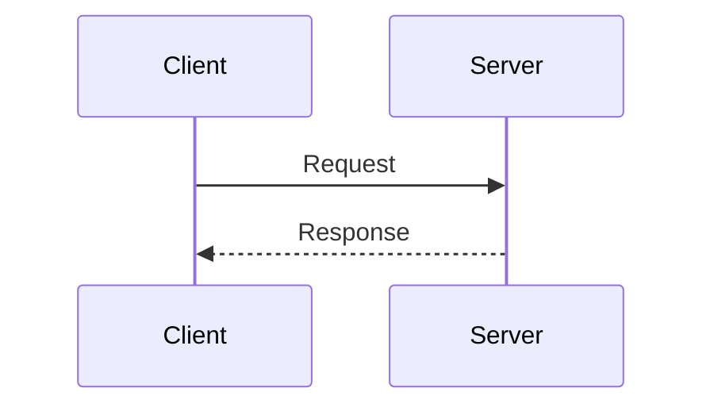
```mermaid
sequenceDiagram
    participant A as Client
    participant B as Server
    A->>B: Request
    B-->>A: Response
```

---

## 3. [作成したシーケンス図ファイルは、`{指定のフォルダ}/sequence_diagrams/`ディレクトリに出力すること](../rules/sequence_create.mdc)

### 背景・理由

- **整理された配置**: シーケンス図を一箇所に集約することで、管理と検索が容易になる
- **プロジェクト構造との整合**: `{指定のフォルダ}/`配下に分析結果を集約する方針と一致する
- **再利用性**: 他のドキュメントから参照しやすい場所に配置することで、再利用が促進される

### 実例

```
{指定のフォルダ}/sequence_diagrams/
├── sequence_{識別子1}.md
├── sequence_{識別子2}.md
└── sequence_{識別子3}.md
```

---

## 4. [ファイル名は`sequence_XXXX.md`形式とし、XXXXには適切な識別子を設定すること](../rules/sequence_create.mdc)

### 背景・理由

- **識別性**: ファイル名から内容を推測できることで、検索や参照が容易になる
- **一貫性**: 統一された命名規則により、複数のシーケンス図を管理しやすくなる
- **拡張性**: 識別子により、同じモジュールの異なるフローを区別できる

### 実例

- `sequence_{識別子1}.md`: {処理フローの説明1}
- `sequence_{識別子2}.md`: {処理フローの説明2}
- `sequence_{識別子3}.md`: {処理フローの説明3}

---

## 5. [シーケンス図を作成する前に、ユーザーに以下を確認すること：作成するシーケンス図の種類（ファイル間のつながり、クラス間のつながり、一つのファイル内の処理フローなど）、対象範囲、抽象度レベル](../rules/sequence_create.mdc)

### 背景・理由

**事前確認の重要性：**
- **誤解の防止**: 作成者の想定とユーザーの期待が異なることを事前に防ぐ
- **効率性**: 不要な修正や再作成を避け、作業時間を短縮できる
- **品質向上**: 明確な要件に基づいて作成することで、より有用な図が生成される

**確認すべき3つの要素：**
1. **種類**: 何を表現する図なのか（モジュール間、クラス間、関数内など）
2. **対象範囲**: どの部分のコードを対象とするのか
3. **抽象度**: どのレベルの詳細度で表現するのか

### 実例

**確認例：**
- 「このシーケンス図は、`{ファイル名1}.cpp`と`{ファイル名2}.cpp`の間の関数呼び出しを表現しますか？それとも、`{ファイル名1}.cpp`内の処理フローを表現しますか？」
- 「対象範囲は、エラーハンドリングを含めますか？それとも正常系のみですか？」
- 「抽象度は、関数名レベルで表現しますか？それともビジネスプロセスレベル（例：『画像を読み込む』）で表現しますか？」

---

## 6. [想像で作成せず、わからないことは必ずユーザーに問いかけること](../rules/sequence_create.mdc)

### 背景・理由

- **正確性の確保**: 推測に基づく図は誤解を招き、後続の作業に悪影響を与える可能性がある
- **信頼性の維持**: 不確実な情報を含む図は、プロジェクト全体の信頼性を損なう
- **効率的なコミュニケーション**: 不明点を早期に確認することで、無駄な作業を避けられる

### 実例

**❌ 悪い例（推測で作成）：**
- コードから読み取れない処理フローを推測して図に含める
- 関数名から処理内容を推測して詳細を記述する

**✅ 良い例（確認してから作成）：**
- 「この関数の戻り値はどのように使用されますか？」
- 「エラー発生時の処理フローはどのようになりますか？」
- 「この条件分岐の意図を教えてください」

---

## 7. [1つのシーケンス図で表現するのは、1つのユースケースや1つの主要な機能だけに絞り、スコープを限定すること](../rules/sequence_create.mdc)

### 背景・理由

- **可読性の向上**: 1つの図に多くの情報を詰め込むと、理解が困難になる
- **保守性の向上**: スコープが明確な図は、コード変更時の更新も容易
- **再利用性**: 小さな単位の図は、他のドキュメントで部分的に参照しやすい

### 実例

**❌ 悪い例（スコープが広すぎる）：**
- 1つの図に「画像読み込み→処理→保存→通知」の全プロセスを含める

**✅ 良い例（スコープが適切）：**
- `sequence_{識別子1}.md`: {処理1}のみ
- `sequence_{識別子2}.md`: {処理2}のみ
- `sequence_{識別子3}.md`: {処理3}のみ

---

## 8. [抽象度を統一すること。「コードレベル（関数名）」で書くのか、「ビジネスプロセスレベル（注文する、承認する）」で書くのかを混ぜないようにすること](../rules/sequence_create.mdc)

### 背景・理由

- **理解の容易さ**: 抽象度が統一されていると、読者は一貫した視点で図を理解できる
- **目的の明確化**: 図の目的（技術的な詳細を理解するのか、ビジネスフローを理解するのか）が明確になる
- **混乱の防止**: 異なる抽象度が混在すると、読者が混乱し、誤解を招く可能性がある

### 実例

**❌ 悪い例（抽象度が混在）：**
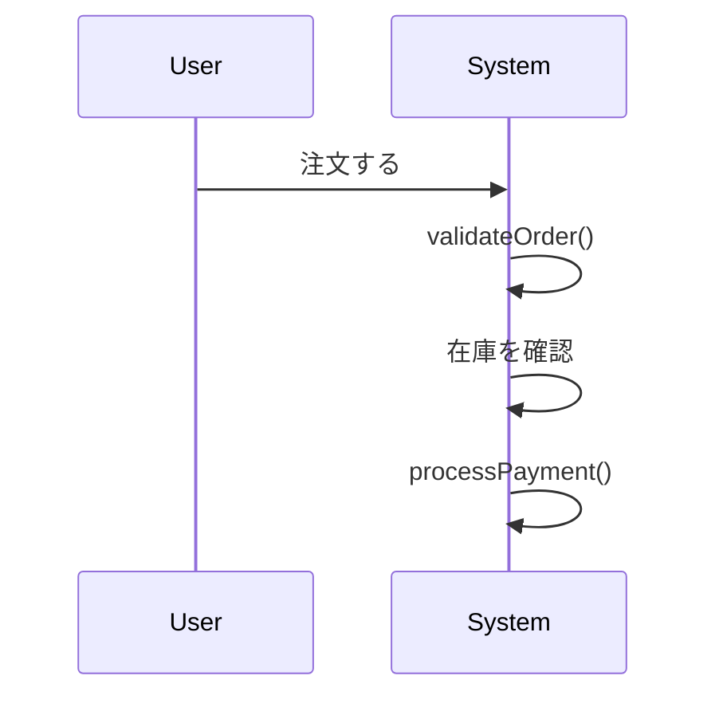
```mermaid
sequenceDiagram
    participant U as User
    participant S as System
    U->>S: 注文する
    S->>S: validateOrder()
    S->>S: 在庫を確認
    S->>S: processPayment()
```

**✅ 良い例（コードレベルで統一）：**
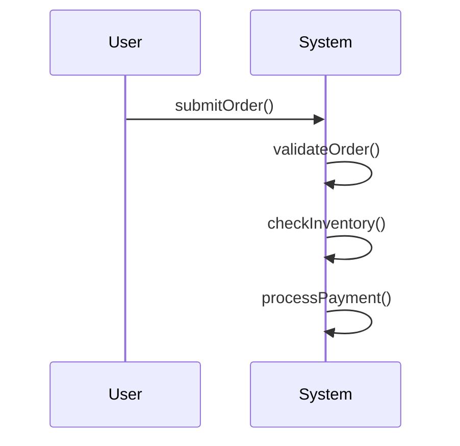
```mermaid
sequenceDiagram
    participant U as User
    participant S as System
    U->>S: submitOrder()
    S->>S: validateOrder()
    S->>S: checkInventory()
    S->>S: processPayment()
```

**✅ 良い例（ビジネスプロセスレベルで統一）：**
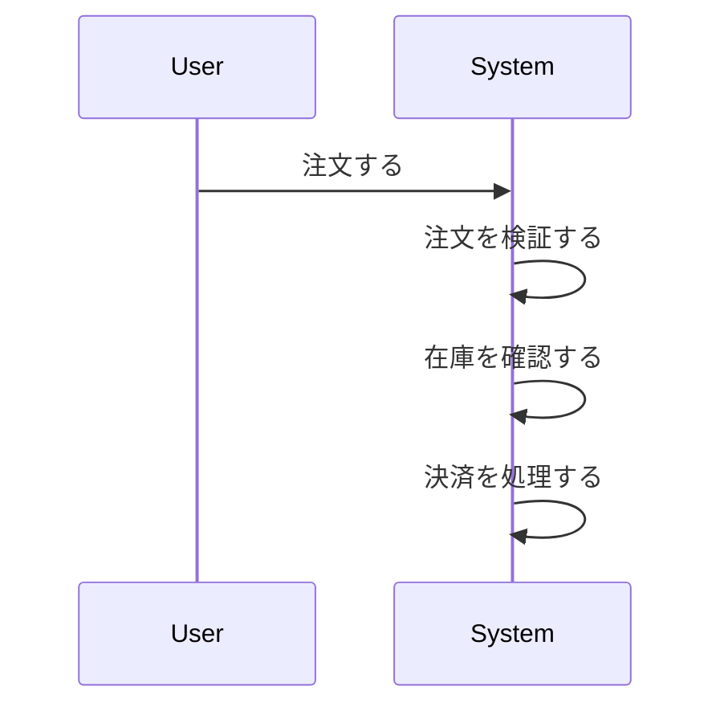
```mermaid
sequenceDiagram
    participant U as User
    participant S as System
    U->>S: 注文する
    S->>S: 注文を検証する
    S->>S: 在庫を確認する
    S->>S: 決済を処理する
```

---

## 9. [処理の起点は一番左に配置し、左から右へ処理が流れるように配置すること](../rules/sequence_create.mdc)

### 背景・理由

- **直感的な理解**: 左から右への流れは、多くの文化で自然な読み方であり、理解しやすい
- **視覚的な整理**: 処理の起点が明確になることで、図全体の構造が把握しやすくなる
- **一貫性**: 統一された配置規則により、複数の図を比較・参照しやすくなる

### 実例

**✅ 良い例：**
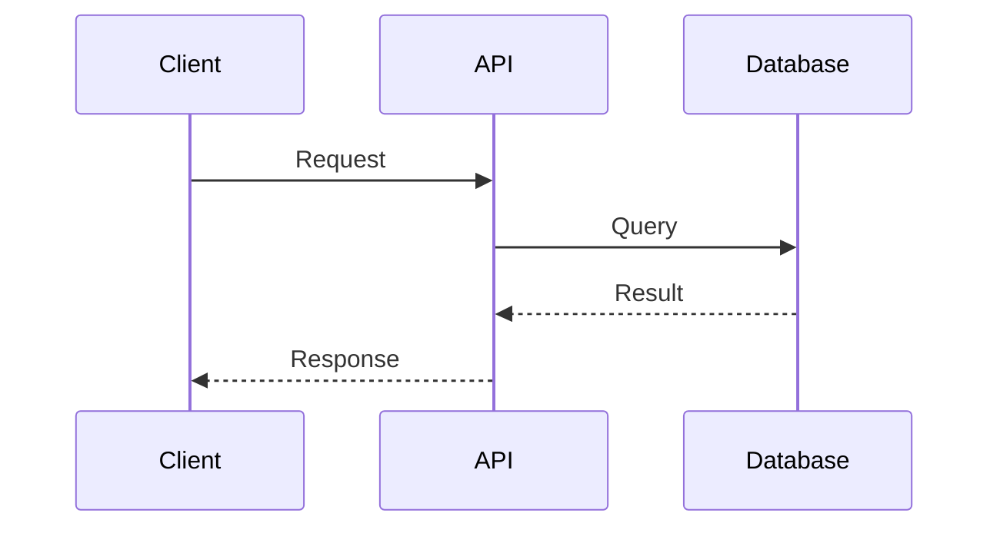
```mermaid
sequenceDiagram
    participant A as Client
    participant B as API
    participant C as Database
    A->>B: Request
    B->>C: Query
    C-->>B: Result
    B-->>A: Response
```

---

## 10. [戻り値（Return Message）は、重要なデータが返ってくる場合や処理の完了を明示したい場合に絞って、破線の矢印（`-->`）で記述すること](../rules/sequence_create.mdc)

### 背景・理由

- **可読性の向上**: すべての矢印に戻り値を書くと図が煩雑になり、重要な情報が埋もれる
- **焦点の明確化**: 重要な戻り値のみを明示することで、読者の注意を適切に誘導できる
- **UML標準**: UMLの標準的な記法に従うことで、一般的な理解が得られる

### 実例

**❌ 悪い例（すべての戻り値を記述）：**
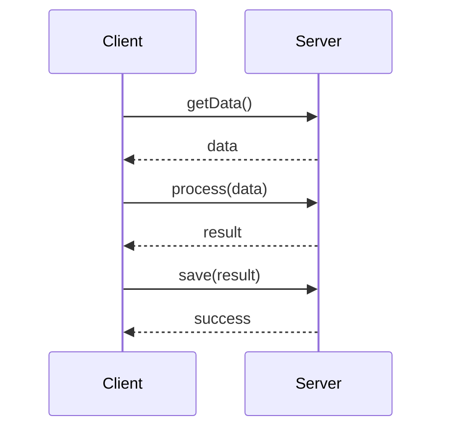
```mermaid
sequenceDiagram
    participant A as Client
    participant B as Server
    A->>B: getData()
    B-->>A: data
    A->>B: process(data)
    B-->>A: result
    A->>B: save(result)
    B-->>A: success
```

**✅ 良い例（重要な戻り値のみ）：**
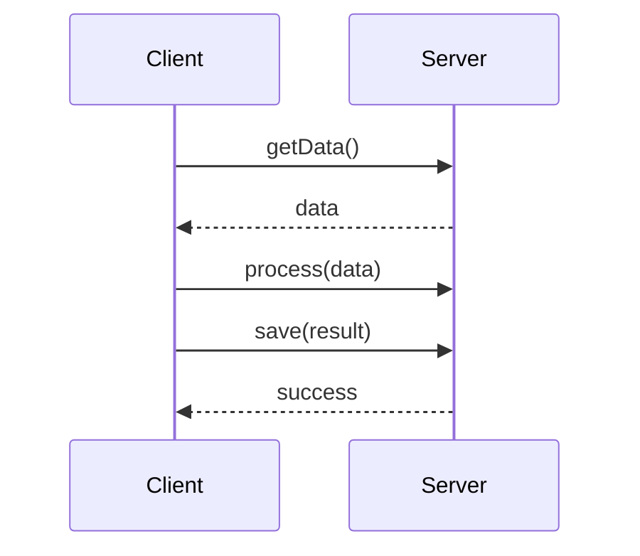
```mermaid
sequenceDiagram
    participant A as Client
    participant B as Server
    A->>B: getData()
    B-->>A: data
    A->>B: process(data)
    A->>B: save(result)
    B-->>A: success
```

---

## 11. [条件分岐やループを記述する際は、UML標準の枠組み（Fragment）を使用すること](../rules/sequence_create.mdc)

### 背景・理由

- **標準準拠**: UML標準に従うことで、一般的な理解が得られ、他のツールとの互換性も保たれる
- **明確な表現**: Fragmentを使用することで、条件分岐やループの範囲と条件が明確になる
- **Mermaid対応**: MermaidはUML標準のFragment構文をサポートしている

### 実例

**条件分岐（alt）:**
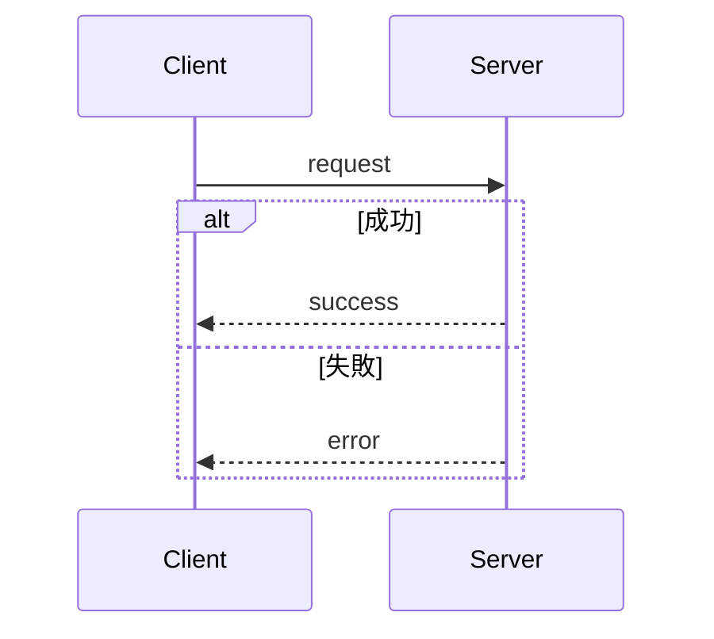
```mermaid
sequenceDiagram
    participant A as Client
    participant B as Server
    A->>B: request
    alt 成功
        B-->>A: success
    else 失敗
        B-->>A: error
    end
```

**ループ（loop）:**
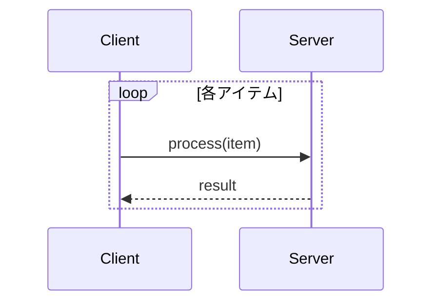
```mermaid
sequenceDiagram
    participant A as Client
    participant B as Server
    loop 各アイテム
        A->>B: process(item)
        B-->>A: result
    end
```

**任意処理（opt）:**
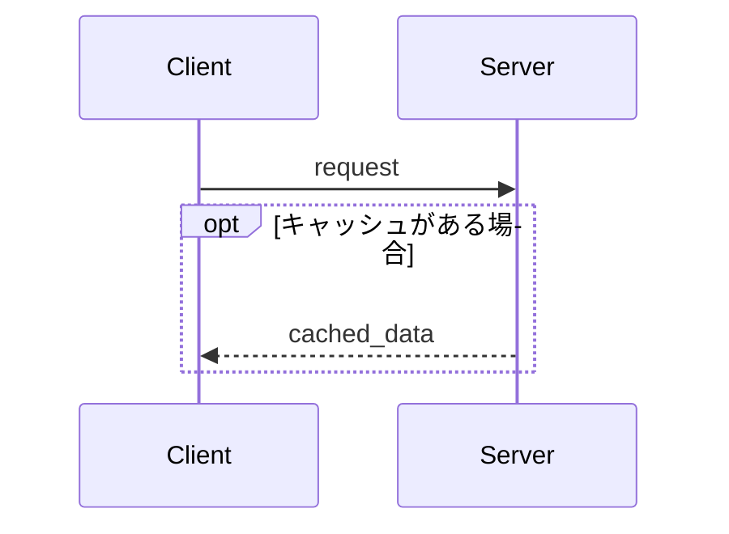
```mermaid
sequenceDiagram
    participant A as Client
    participant B as Server
    A->>B: request
    opt キャッシュがある場合
        B-->>A: cached_data
    end
```

---

## 12. [シーケンス図は上から下に向かって時間が流れることを意識し、同期（黒塗り矢印`->`）と非同期（開き矢印`->>`）を適切に使い分けること](../rules/sequence_create.mdc)

### 背景・理由

- **時間軸の明確化**: 上から下への時間の流れは、シーケンス図の基本原則であり、処理の順序を明確に表現する
- **同期・非同期の区別**: 処理が同期的に待機するのか、非同期で進行するのかを明確にすることで、パフォーマンスやデッドロックなどの問題を理解しやすくなる
- **正確な設計理解**: 同期・非同期の区別は、システムの設計や動作を正確に理解する上で重要

### 実例

**同期処理（`->`）:**
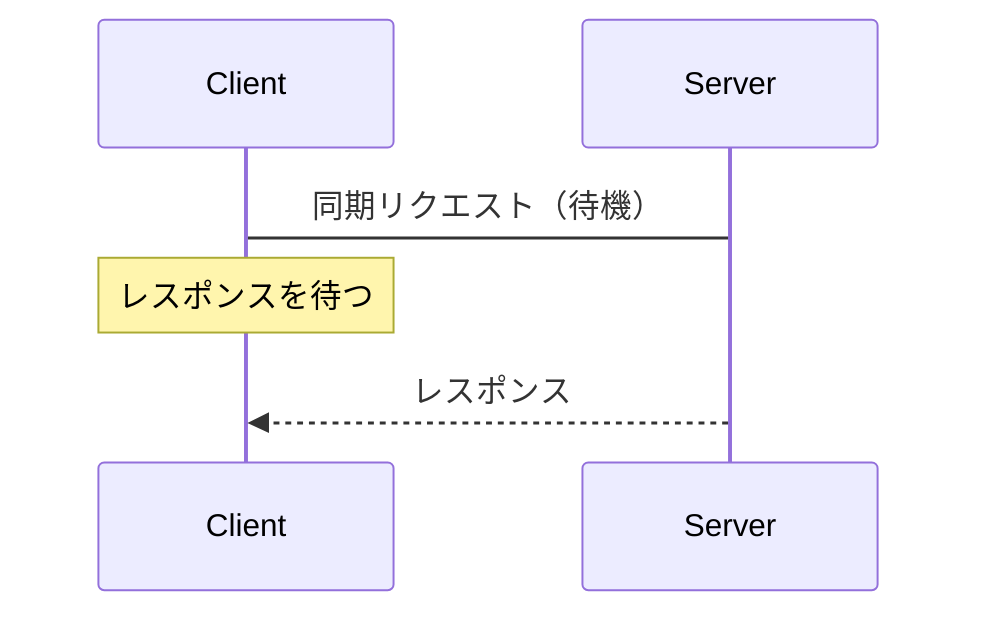
```mermaid
sequenceDiagram
    participant A as Client
    participant B as Server
    A->B: 同期リクエスト（待機）
    Note over A: レスポンスを待つ
    B-->>A: レスポンス
```

**非同期処理（`->>`）:**
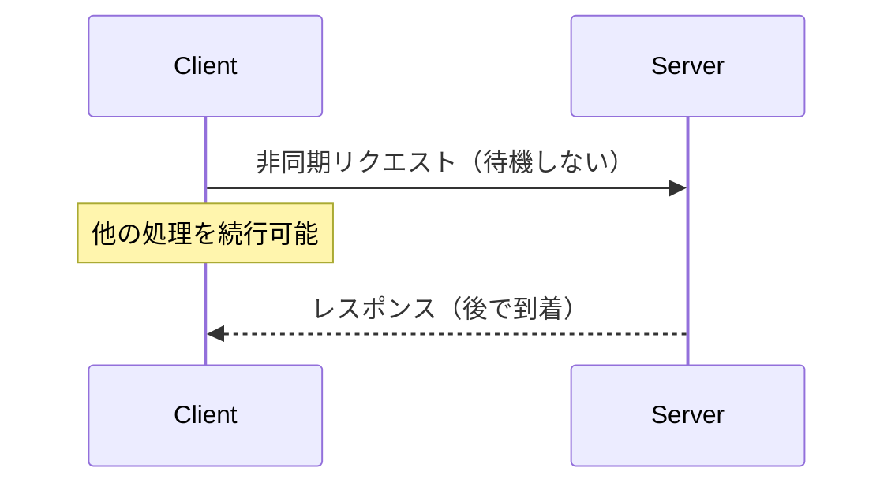
```mermaid
sequenceDiagram
    participant A as Client
    participant B as Server
    A->>B: 非同期リクエスト（待機しない）
    Note over A: 他の処理を続行可能
    B-->>A: レスポンス（後で到着）
```

---

## 13. [実行仕様（Activation Bar）を適切に使用し、どのオブジェクトが処理中であるかを明確にすること](../rules/sequence_create.mdc)

### 背景・理由

- **処理状態の可視化**: Activation Barにより、どのオブジェクトがどの時点で処理中であるかが一目で分かる
- **並行処理の理解**: 複数のオブジェクトが同時に処理を行っている場合、その関係を明確に表現できる
- **デバッグ支援**: 処理の流れを追跡する際に、どのオブジェクトが責任を持っているかが明確になる

### 実例

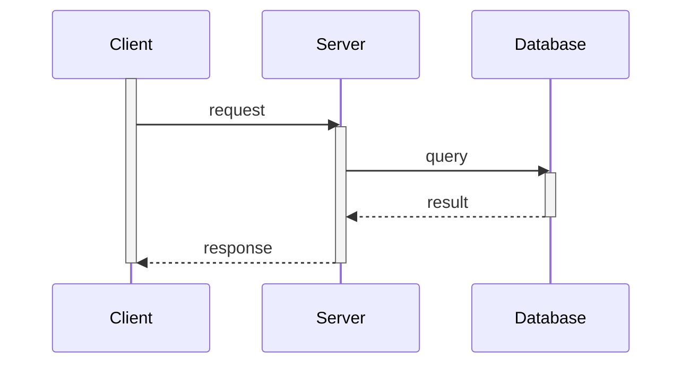
```mermaid
sequenceDiagram
    participant A as Client
    participant B as Server
    participant C as Database
    activate A
    A->>B: request
    activate B
    B->>C: query
    activate C
    C-->>B: result
    deactivate C
    B-->>A: response
    deactivate B
    deactivate A
```

---

## 14. [ロジックの書きすぎを避け、「なぜその分岐が必要か」という意図が伝わる程度に留めること](../rules/sequence_create.mdc)

### 背景・理由

- **可読性の維持**: 過度に詳細なロジックを記述すると、図が複雑になり、全体像が把握しにくくなる
- **目的の明確化**: シーケンス図の目的は処理の流れを理解することであり、実装の詳細を記述することではない
- **保守性**: 詳細なロジックを含めると、コード変更時に図の更新が頻繁に必要になり、保守コストが増大する

### 実例

**❌ 悪い例（ロジックが詳細すぎる）：**
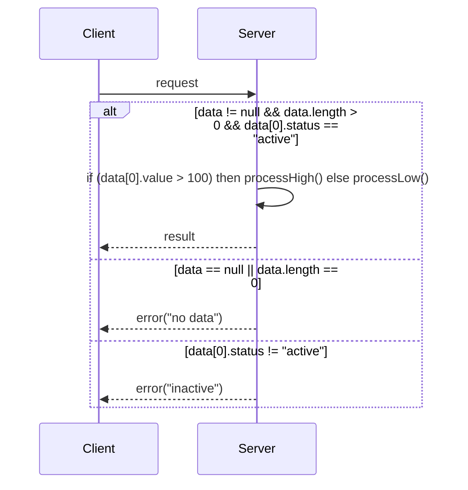
```mermaid
sequenceDiagram
    participant A as Client
    participant B as Server
    A->>B: request
    alt data != null && data.length > 0 && data[0].status == "active"
        B->>B: if (data[0].value > 100) then processHigh() else processLow()
        B-->>A: result
    else data == null || data.length == 0
        B-->>A: error("no data")
    else data[0].status != "active"
        B-->>A: error("inactive")
    end
```

**✅ 良い例（意図が伝わる程度）：**
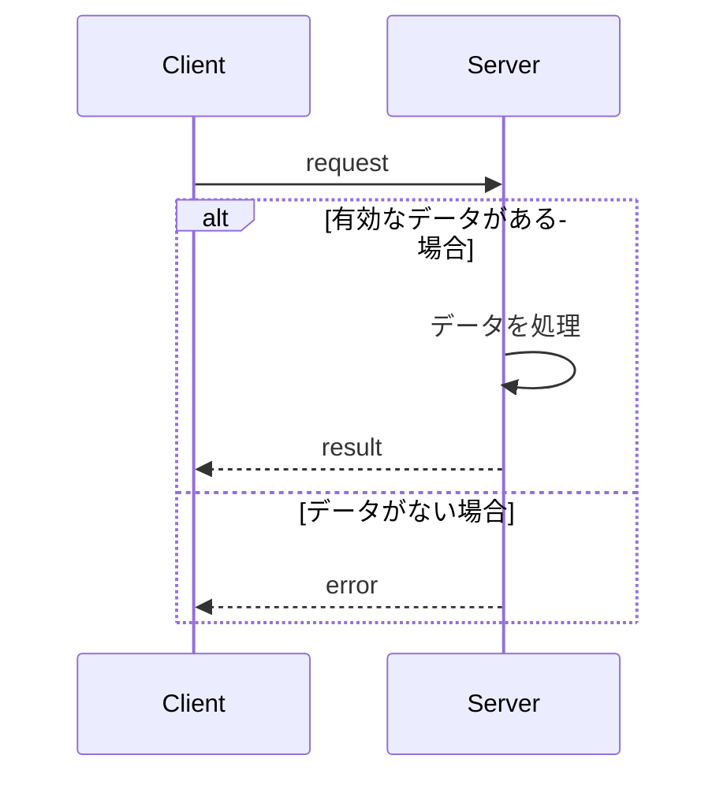
```mermaid
sequenceDiagram
    participant A as Client
    participant B as Server
    A->>B: request
    alt 有効なデータがある場合
        B->>B: データを処理
        B-->>A: result
    else データがない場合
        B-->>A: error
    end
```

---

## 15. [オブジェクトの並び順を見直し、線が交差しないように調整すること](../rules/sequence_create.mdc)

### 背景・理由

- **可読性の向上**: 線が交差すると、どのオブジェクト間で通信が行われているかが分かりにくくなる
- **視覚的な整理**: オブジェクトを適切に配置することで、処理の流れが自然に理解できる
- **プロフェッショナリズム**: 整理された図は、ドキュメント全体の品質を高める

### 実例

**❌ 悪い例（線が交差している）：**
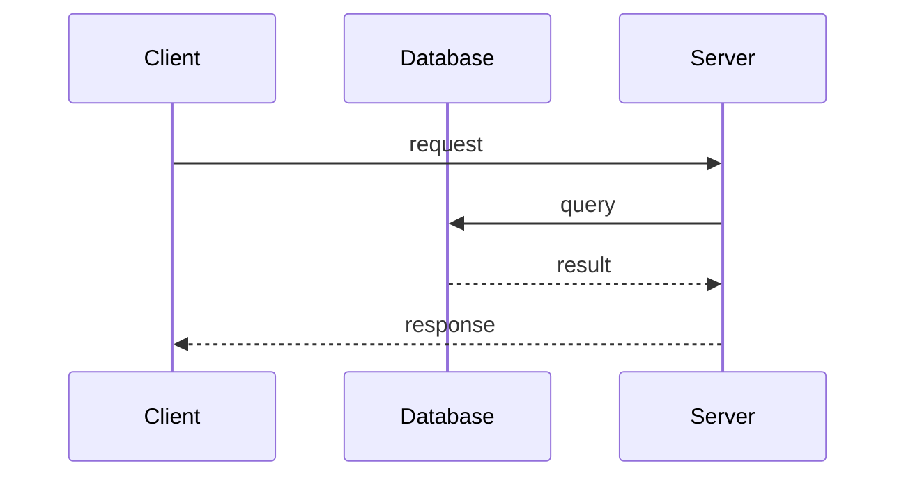
```mermaid
sequenceDiagram
    participant A as Client
    participant C as Database
    participant B as Server
    A->>B: request
    B->>C: query
    C-->>B: result
    B-->>A: response
```

**✅ 良い例（線が交差しない）：**
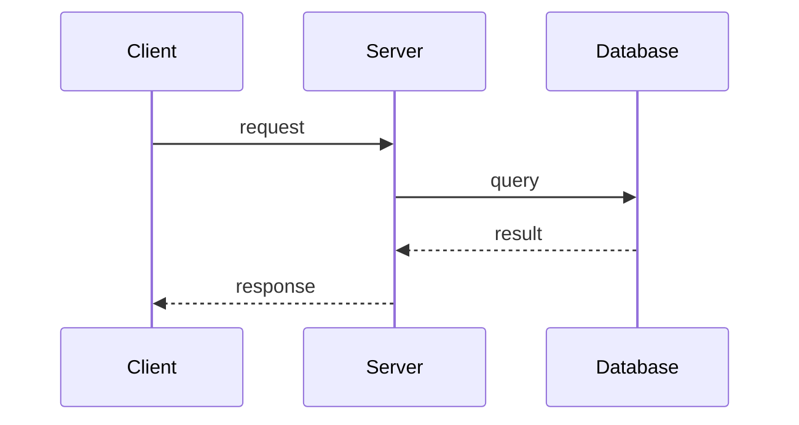
```mermaid
sequenceDiagram
    participant A as Client
    participant B as Server
    participant C as Database
    A->>B: request
    B->>C: query
    C-->>B: result
    B-->>A: response
```
