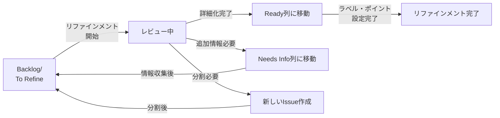

# リファインメント進め方（60分コース）

## はじめに

本ドキュメントは、スクラムにおけるリファインメント（プロダクトバックログリファインメント）を60分で効率的に進めるためのガイドラインです。このドキュメントを活用することで、チーム全員が共通認識を持ち、次のイテレーションに向けて準備を整えることができます。

**前提条件**：本ドキュメントは、GitHub Projectsのカンバンボードを使用してプロダクトバックログを管理していることを前提としています。

## リファインメントの目的

リファインメントは、プロダクトバックログアイテム（PBI）を詳細化し、チーム全体で理解を深めるためのアクティビティです。以下の目的を持ちます。

1. **共通理解の形成**：チーム全員がPBIの内容を正しく理解する
2. **実装可能性の検証**：技術的な実現方法を確認し、リスクを洗い出す
3. **見積もりの精度向上**：詳細化により、工数見積もりの精度を高める
4. **依存関係の明確化**：他のPBIや外部要因との依存関係を特定する

## リファインメントのゴール

リファインメント終了時には、以下の状態を達成することを目指します。

### 必達ゴール

- [ ] 次イテレーションで着手予定のPBIが全て「Ready（準備完了）」状態になっている
- [ ] 各PBIの受入条件（Acceptance Criteria）が明確に定義されている
- [ ] 開発チーム全員がPBIの内容を理解している
- [ ] 各PBIの相対見積もり（ストーリーポイント）が合意されている

### 推奨ゴール

- [ ] 次イテレーション+1の主要PBIについても概要を把握している
- [ ] 技術的な課題や調査が必要な項目が明確になっている
- [ ] 外部依存やブロッカーが特定され、解決策が検討されている

## 60分タイムスケジュール

| 時間 | セクション | 内容 |
|------|-----------|------|
| 0-5分 | オープニング | 目的・ゴールの確認、参加者の確認 |
| 5-40分 | PBIレビュー | 各PBIの詳細化と見積もり（メイン） |
| 40-55分 | 次イテレーション計画の確認 | 優先順位の確認と実施内容の最終調整 |
| 55-60分 | クロージング | アクションアイテムの確認、次回予定 |

## 各セクションの詳細

### 1. オープニング（0-5分）

**ファシリテーター（通常はプロダクトオーナー）が実施**

- 本日のリファインメントの目的を説明
- 対象とするイテレーション（スプリント）の確認
- 参加者の出席確認
- タイムボックスの共有（60分厳守）

**GitHub Projectsカンバンの準備**
1. プロダクトオーナーがGitHub Projectsのカンバンボード画面を共有
2. 対象イテレーションのビュー（フィルター）を適用
3. レビュー対象のPBIが正しく表示されているか確認

**チェックポイント**
- [ ] 全員が画面共有やツールにアクセスできているか
- [ ] GitHub Projectsのカンバンボードが全員に見えているか
- [ ] 前回のリファインメントからの宿題やアクションアイテムがあれば確認
- [ ] レビュー対象のIssueが「Backlog」または「To Refine」ステータスにあるか

### 2. PBIレビュー（5-40分）【メインセクション】

次イテレーションで実施予定のPBIを優先度順にレビューします。1つのPBIあたり5-10分を目安とします。

#### 2.1 各PBIのレビュー項目

各PBIについて、以下の観点で詳細化を行います。

**① 概要説明（1-2分）**
- プロダクトオーナーがPBIの背景と期待される価値を説明
- ユーザーストーリー形式での確認：「〇〇として、△△したい、なぜなら××だから」

**② 要件の詳細化（2-3分）**
- 機能要件の具体的な内容
- 画面モックアップやワイヤーフレームの確認（ある場合）
- データの入出力仕様
- 業務フローとの関係

**③ 受入条件の確認（1-2分）**
- 「何ができたら完成とするか」の明確化
- テストシナリオの概要確認
- 非機能要件（パフォーマンス、セキュリティなど）の確認

**④ 技術的検討（2-3分）**
- 実装アプローチの確認
- 既存コードへの影響範囲
- 技術的なリスクや課題の洗い出し
- 外部APIや他システムとの連携の有無
- データベーススキーマの変更要否

**⑤ 依存関係の特定（1分）**
- 他のPBIとの依存関係
- 外部チームや関係者への依頼事項
- 環境やインフラの準備要否

**⑥ 見積もり（1-2分）**
- プランニングポーカーなどの手法で相対見積もりを実施
- 見積もりが大きく乖離した場合は、認識のズレを確認
- 大きすぎるPBI（例：13ポイント以上）は分割を検討

**⑦ GitHub Projectsカンバンの更新（各PBIレビュー後）**

各PBIのレビューが完了したら、即座にカンバンボードを更新します。

1. **Issue本体の更新**
   - 受入条件を「Description」または「Acceptance Criteria」セクションに記載
   - ストーリーポイントをカスタムフィールドに入力（例：`Story Points: 5`）
   - 技術的な注意事項をコメントまたは本文に追記

2. **ラベルの付与**
   ```
   例：
   - `Ready` ラベルを付与（詳細化完了の印）
   - `Sprint-XX` ラベルで対象スプリントを明示
   - `Frontend` / `Backend` など技術領域のラベル
   - `High Priority` など優先度ラベル（必要に応じて）
   ```

3. **ステータスの変更**
   - リファインメント完了 → カンバンで「Backlog」から「Ready」列に移動
   - 追加調査が必要 → 「Needs Info」列に移動し、Assigneeを設定
   - 分割が必要と判断 → 元のIssueに「要分割」ラベルを付与

4. **カスタムフィールドの設定**
   ```
   - Story Points: 見積もりポイント数
   - Sprint: 対象スプリント名
   - Priority: High / Medium / Low
   - Status: Ready / Needs Info / Blocked など
   ```

5. **依存関係の記録**
   - 他のIssueに依存する場合、Issue本文に `Depends on #123` と記載
   - またはGitHub Projectsの「Tracked by」機能を使用

#### 2.2 レビュー時の注意点

- **タイムボックスを守る**：1つのPBIに時間をかけすぎない
- **深入りしすぎない**：詳細な設計は実装時に行う
- **全員参加を促す**：特定の人だけが話さないように配慮
- **疑問点は即座に解消**：後回しにせず、その場で確認
- **Readyの定義を満たしているか確認**：チームで定めた基準を満たしているか

### 3. 次イテレーションでやることの確認（40-55分）

PBIの詳細化が完了したら、次イテレーション全体の見通しを確認します。

#### 3.1 優先順位の最終確認（5分）

**プロダクトオーナーによる説明**
- ビジネス価値の観点からの優先順位
- リリース計画との関係
- ステークホルダーからの期待やコミットメント

**チームによる確認**
- 技術的な依存関係から見た実施順序
- リスクの高いものを先に着手すべきか
- 並行作業の可能性

**GitHub Projectsカンバンでの優先順位調整**

1. **Ready列内での並び替え**
   - 「Ready」列内で、Issueをドラッグ&ドロップして優先順位順に並べ替え
   - 上にあるものほど優先度が高いというルールを徹底

2. **Priorityフィールドの設定**
   - 必須で着手：`Priority: High`
   - 余裕があれば着手：`Priority: Medium`
   - 持ち越し可能：`Priority: Low`

3. **視覚的な確認**
   - カンバンボード全体を俯瞰し、次イテレーションのワークロードを確認
   - 「Ready」列のIssue数が適切か（多すぎず、少なすぎず）

#### 3.2 ベロシティと実施可能性の検討（5分）

**過去の実績確認**
- 直近3イテレーションの平均ベロシティ
- 今回の特殊事情（休暇、イベントなど）の考慮

**実施内容の調整**
- 見積もりポイントの合計がベロシティに収まっているか
- 収まらない場合、優先度の低いPBIを次回送りに検討
- バッファの確保（予期せぬ問題への対応余地）

**GitHub Projectsでのストーリーポイント確認**

1. **合計ポイントの算出**
   - GitHub Projectsの「Sum」機能を使用（カスタムフィールド「Story Points」の合計を表示）
   - または手動で「Ready」列のIssueのストーリーポイントを合算

2. **調整が必要な場合のカンバン操作**
   - ポイント超過時：優先度の低いIssueを「Ready」から「Backlog」に戻す
   - ポイント不足時：次の優先度のIssueを「Backlog」から「Ready」に移動
   - 調整したIssueには理由をコメントで記録（例：「ベロシティ超過のため次スプリント送り」）

3. **ビューの活用**
   - スプリント別ビューで、対象スプリントのIssueのみを表示
   - ストーリーポイントでグループ化して、作業量のバランスを確認

#### 3.3 リスクとブロッカーの確認（3分）

次イテレーション開始前に解決すべき課題を洗い出します。

**確認項目**
- [ ] 外部への依頼事項は完了しているか（または完了予定は明確か）
- [ ] 必要な環境は準備できているか
- [ ] 技術調査が必要なものは着手できる状態か
- [ ] 仕様の不明点で未解決のものはないか

**ブロッカーへの対処**
- 担当者のアサイン
- 期限の設定
- エスカレーションの要否判断

#### 3.4 次イテレーション計画の確認（2分）

**イテレーション全体の見通しを共有**
- イテレーション期間の再確認（開始日・終了日）
- 主要なマイルストーン
- デモやレビューの予定
- チームメンバーの稼働状況（休暇予定など）

**期待される成果の明確化**
- イテレーション終了時に何が完成しているべきか
- ステークホルダーへのデモ内容
- リリース可能な状態になるか

### 4. クロージング（55-60分）

リファインメントを振り返り、次のアクションを明確にします。

#### 4.1 アクションアイテムの確認（3分）

リファインメント中に出た宿題を整理します。

**記録すべき内容**
- アクション内容
- 担当者
- 期限
- 優先度

**アクション例**
- プロダクトオーナー：特定の仕様について顧客に確認
- 開発者：技術調査のスパイクを実施
- デザイナー：画面モックアップの作成
- インフラ担当：環境の準備

#### 4.2 Readyでないアイテムの扱い（1分）

時間内に詳細化が完了しなかったPBIの対応を決定します。

**対応パターン**
- 別途、個別のミーティングを設定
- 非同期で詳細化を進める
- 次回のリファインメントで再度扱う
- 次イテレーションの対象から外す

#### 4.3 GitHub Projectsカンバンの最終確認（1分）

リファインメント終了前に、カンバンボードの状態を最終確認します。

**確認項目**
- [ ] 「Ready」列に次イテレーションで着手するIssueがすべて揃っている
- [ ] 各Issueに`Ready`ラベルが付与されている
- [ ] ストーリーポイントが全Issueに設定されている
- [ ] 優先順位順に並んでいる
- [ ] 依存関係が明記されている
- [ ] 「Needs Info」列のIssueにAssigneeと期限が設定されている

**Projectの「Insights」機能の活用**
- Insightsタブで次イテレーションの概要を確認
- ストーリーポイントの合計、Issue数、担当者別の分布などを視覚的に把握

#### 4.4 次回リファインメント予定の確認（1分）

- 次回の日時
- 対象となるイテレーション
- 事前準備が必要な事項

## リファインメントを成功させるポイント

### 事前準備

**プロダクトオーナー**
- PBIの概要を事前に整理しておく
- 可能であれば、事前にバックログアイテムを共有し、チームメンバーが目を通せるようにする
- 画面モックアップやドキュメントを準備
- **GitHub Projects準備**
  - レビュー対象のIssueを「Backlog」または「To Refine」列に配置
  - Issue本文に最低限の情報（背景、目的）を記載
  - 関連資料へのリンクを添付
  - 対象スプリントのラベルを付与

**開発チーム**
- 事前共有されたPBIに目を通しておく
- 疑問点や確認したいことをメモしておく
- 関連する技術情報を予習
- **GitHub Projects確認**
  - レビュー対象のIssueに目を通す
  - 技術的な懸念事項があればコメントで事前共有

### ファシリテーションのコツ

1. **タイムキーパーを決める**：時間管理専任者がいると効果的
2. **議論が発散したら軌道修正**：詳細すぎる議論は別途実施
3. **全員の意見を引き出す**：黙っている人に積極的に意見を求める
4. **視覚化を活用**：ホワイトボードやツールで情報を共有
5. **結論を明確にする**：各PBIについての決定事項を明示

### よくある課題と対策

| 課題 | 対策 |
|------|------|
| 時間内に終わらない | PBIの数を絞る、事前準備を徹底する |
| 特定の人だけが話す | ラウンドロビン形式で意見を聞く |
| 技術的な議論が長引く | タイムボックスを設け、別途技術MTGを設定 |
| 仕様が曖昧で決まらない | プロダクトオーナーが確認して後日フォロー |
| 見積もりが合わない | 認識の違いを明確にし、前提を揃える |

## Readyの定義（参考例）

チームで以下のような「Readyの定義」を設定すると、リファインメントの完了基準が明確になります。

- [ ] ユーザーストーリーが明確に記述されている
- [ ] 受入条件が具体的に定義されている
- [ ] 画面イメージまたはワイヤーフレームが用意されている（UI変更がある場合）
- [ ] 技術的な実現方法が検討され、大きなリスクがない
- [ ] 依存関係が明確になっている
- [ ] 見積もりが完了している
- [ ] 1イテレーション内で完了できるサイズである
- [ ] テスト方法が検討されている

## チェックリスト

リファインメント実施時に活用してください。

### 開始前
- [ ] 対象PBIがバックログで優先順位付けされている
- [ ] 参加者全員が招集されている
- [ ] 必要な資料（仕様書、モックアップなど）が準備されている
- [ ] オンラインツール（プランニングポーカーなど）が使用可能
- [ ] **GitHub Projects準備完了**
  - [ ] レビュー対象のIssueが「Backlog」または「To Refine」列にある
  - [ ] カンバンボードが画面共有できる状態
  - [ ] 必要なカスタムフィールド（Story Points、Sprint等）が設定済み

### 実施中
- [ ] 各PBIについて、要件・受入条件・技術検討・見積もりが完了している
- [ ] 疑問点や不明点がその場で解消されている
- [ ] アクションアイテムが記録されている
- [ ] タイムボックスが守られている
- [ ] **GitHub Projectsリアルタイム更新**
  - [ ] レビュー完了したIssueを即座に「Ready」列に移動
  - [ ] ストーリーポイント・ラベル・受入条件を各Issueに追記
  - [ ] 依存関係を明記

### 終了後
- [ ] 次イテレーションで着手するPBIが明確になっている
- [ ] 全てのPBIが「Ready」状態である
- [ ] アクションアイテムに担当者と期限が設定されている
- [ ] 次回リファインメントの予定が決まっている
- [ ] リファインメントの結果がバックログに反映されている
- [ ] **GitHub Projectsの状態確認**
  - [ ] 「Ready」列のIssueがストーリーポイント合計でベロシティ内に収まっている
  - [ ] 全Issueに`Ready`ラベルとストーリーポイントが設定されている
  - [ ] 優先順位順に並んでいる
  - [ ] 「Needs Info」のIssueに担当者と期限が設定されている

## GitHub Projectsカンバンの運用方法

このセクションでは、リファインメントで使用するGitHub Projectsのカンバンボードの具体的な運用方法を説明します。

### カンバンボードの列構成

推奨するカンバンボードの列構成は以下の通りです。

| 列名 | 説明 | 想定されるIssue |
|------|------|----------------|
| **Backlog** | まだリファインメントされていない項目 | 優先度が決まっていない、または将来実施予定の項目 |
| **To Refine** | 次回リファインメント対象 | 次のリファインメントで詳細化する予定の項目 |
| **Needs Info** | 追加情報が必要 | 仕様確認待ち、技術調査待ちなどブロックされている項目 |
| **Ready** | 開発着手可能 | リファインメント完了済み、次イテレーションで着手予定 |
| **In Progress** | 開発中 | イテレーション開始後、開発が進行中の項目 |
| **In Review** | レビュー中 | プルリクエストが作成され、レビュー待ちの項目 |
| **Done** | 完了 | イテレーション内で完了した項目 |

### Issue（PBI）の作成ルール

**Issue作成時の必須項目**
```markdown
## 背景・目的
（なぜこの機能が必要か）

## 実現したいこと
（ユーザーストーリー形式で記載）
〇〇として、△△したい、なぜなら××だから

## 受入条件
- [ ] 条件1
- [ ] 条件2
- [ ] 条件3

## 参考資料
- [関連ドキュメント](URL)
- [画面モックアップ](URL)
```

**ラベルの使用ルール**
- `Ready`: リファインメント完了
- `Sprint-XX`: 対象スプリント（例：`Sprint-23`）
- `Frontend` / `Backend` / `Infrastructure`: 技術領域
- `Bug` / `Feature` / `Enhancement`: Issue種別
- `High Priority` / `Medium Priority` / `Low Priority`: 優先度
- `Blocked`: ブロックされている状態

### カスタムフィールドの設定

GitHub Projectsで以下のカスタムフィールドを設定することを推奨します。

1. **Story Points（数値型）**
   - 見積もりポイントを記録
   - 合計値を表示して、イテレーションの作業量を把握

2. **Sprint（単一選択型）**
   - 対象スプリントを選択
   - オプション例：`Sprint 23`, `Sprint 24`, `Backlog`

3. **Priority（単一選択型）**
   - 優先度を選択
   - オプション：`High`, `Medium`, `Low`

4. **Status（単一選択型）**
   - Issueの状態（カンバンの列と連動）
   - オプション：`Backlog`, `To Refine`, `Needs Info`, `Ready`, `In Progress`, `In Review`, `Done`

### リファインメント時のカンバン操作フロー



### ビューの活用

GitHub Projectsの「ビュー」機能を活用して、目的別にIssueを表示します。

**推奨ビュー例**

1. **リファインメントビュー**
   - フィルター：`Status:To Refine`
   - ソート：Priority（High→Low）
   - 表示項目：Title、Story Points、Sprint、Assignee

2. **次スプリントビュー**
   - フィルター：`Status:Ready AND Sprint:次スプリント名`
   - ソート：カスタム順序（優先順位順に手動調整）
   - 表示項目：Title、Story Points、Priority、Labels

3. **進行中ビュー**
   - フィルター：`Status:In Progress OR Status:In Review`
   - グループ化：Assignee
   - 表示項目：Title、Story Points、Status

4. **ベロシティ確認ビュー**
   - フィルター：`Sprint:対象スプリント名`
   - グループ化：Status
   - 集計：Story Pointsの合計を表示

### Insightsの活用

GitHub ProjectsのInsights機能で以下を確認できます。

1. **バーンダウンチャート**
   - イテレーション中の進捗を可視化
   - 残作業量の推移を確認

2. **ストーリーポイント集計**
   - スプリント別の合計ポイント
   - 完了したポイント数

3. **Issue数の推移**
   - 新規作成・完了・未完了のIssue数

### リファインメント後の運用

**スプリントプランニング時**
1. 「Ready」列のIssueを上から順に確認
2. チームがコミットするIssueを決定
3. 決定したIssueを「In Progress」列に移動（またはイテレーション開始後に移動）

**デイリースクラム時**
- カンバンボードを画面共有
- 各自の担当Issueの進捗を「In Progress」→「In Review」→「Done」と更新

**スプリントレビュー/レトロスペクティブ後**
- 完了したIssue（「Done」列）をアーカイブまたはクローズ
- 未完了のIssueを次スプリントの「Ready」または「Backlog」に移動

### よくあるカンバン操作のTips

**Issue間の依存関係を表現する方法**
```markdown
## 依存関係
- Blocked by: #123（このIssueが完了しないと着手できない）
- Depends on: #456（このIssueに依存している）
- Related to: #789（関連するIssue）
```

**大きなIssueを分割する方法**
1. 元のIssueに`epic`ラベルを付与
2. 子Issueを作成し、タイトルに`[親Issue番号] 子タスク名`と記載
3. 子Issueの本文に`Part of #親Issue番号`と記載
4. GitHub Projectsの「Tracked by」機能で親子関係を明示

**ブロック状態の明示方法**
1. Issueに`Blocked`ラベルを付与
2. 「Needs Info」列に移動
3. コメントでブロック理由と解除条件を記載
4. Assigneeに対応者を設定

**テンプレートの活用**
- GitHub Issueテンプレートを作成し、PBI作成時の記入漏れを防ぐ
- `.github/ISSUE_TEMPLATE/`配下に`feature_request.md`などを配置

## 参考資料

### 関連ドキュメント
- スプリントプランニング進め方
- デイリースクラム実施ガイド
- スプリントレビュー・レトロスペクティブ手順

### 用語集
- **PBI（Product Backlog Item）**：プロダクトバックログアイテムの略。実装する機能や修正を表す単位。GitHub ProjectsではIssueとして管理
- **ベロシティ**：チームが1イテレーションで完了できるストーリーポイントの合計
- **受入条件（Acceptance Criteria）**：機能が完成したと判断するための基準
- **Ready**：開発チームが着手できる状態。チームごとに定義が異なる
- **スパイク**：技術調査や実現可能性を検証するための時間枠を設けたタスク
- **カンバンボード**：タスクの状態を視覚的に管理するボード。GitHub Projectsで提供
- **ストーリーポイント**：相対的な作業量の見積もり単位。フィボナッチ数列（1, 2, 3, 5, 8, 13...）を使用することが多い
- **カスタムフィールド**：GitHub Projectsで追加できる独自の項目（Story Points、Priority、Sprintなど）

---

**文書履歴**
- 初版作成日：2026年1月4日
- GitHub Projectsカンバン操作追加：2026年1月4日
- 最終更新日：2026年1月4日

