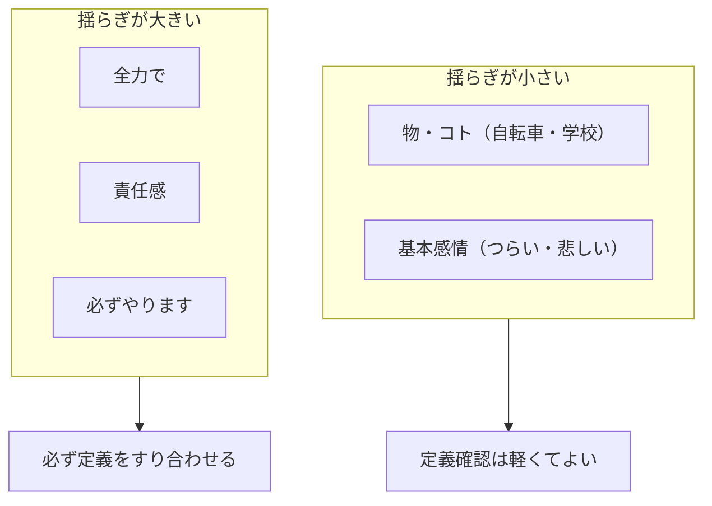
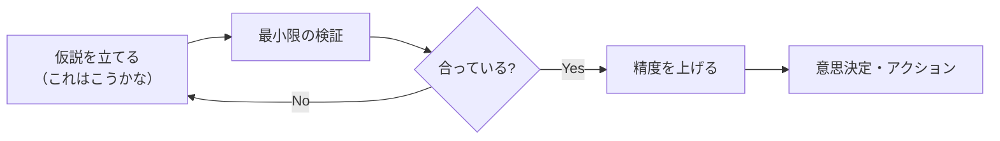
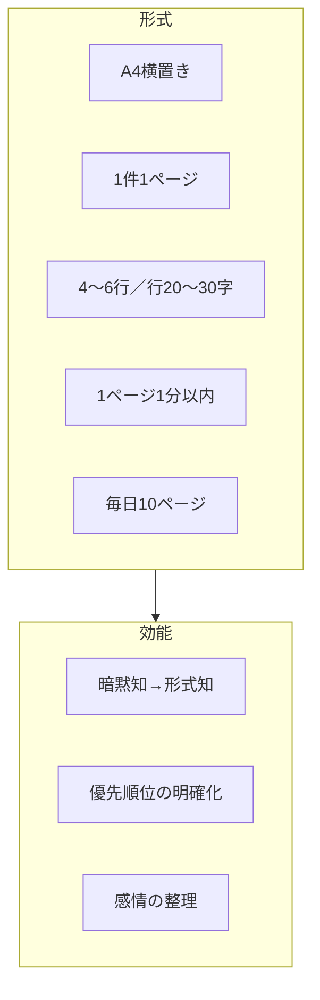
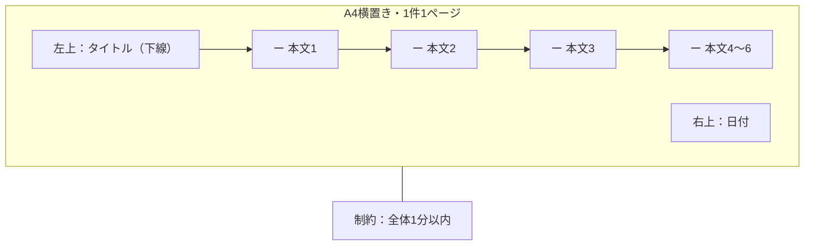
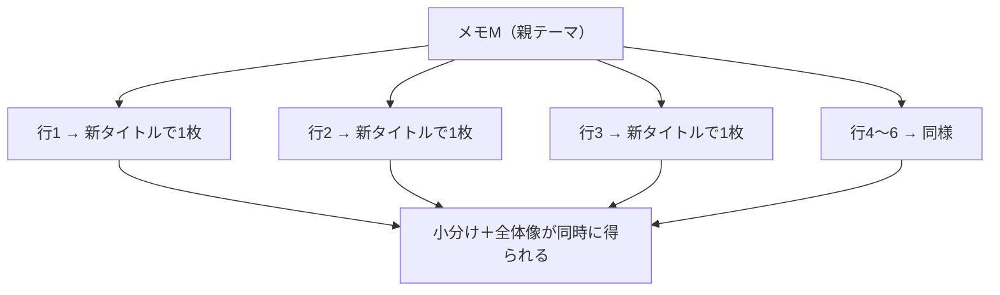
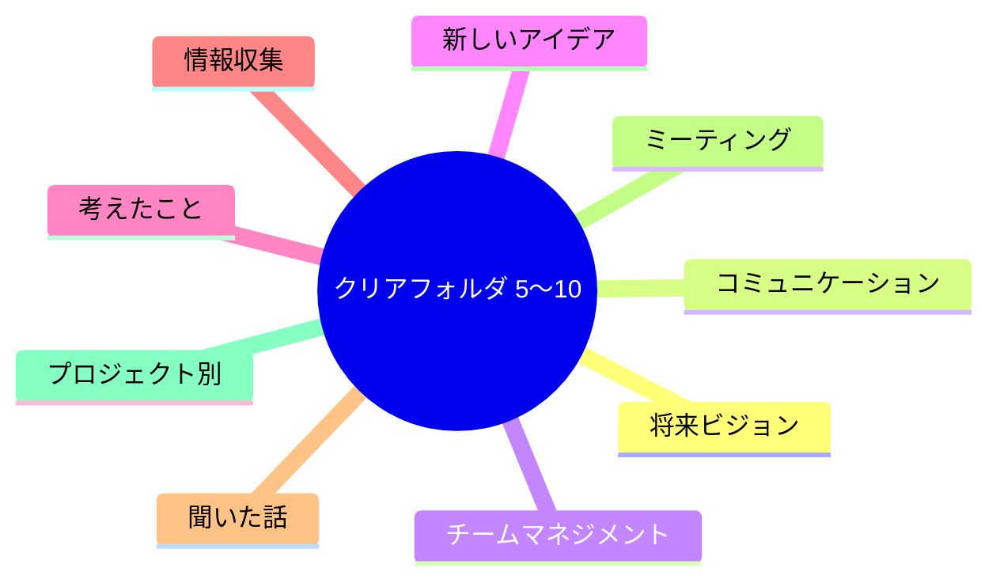
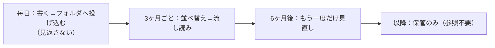
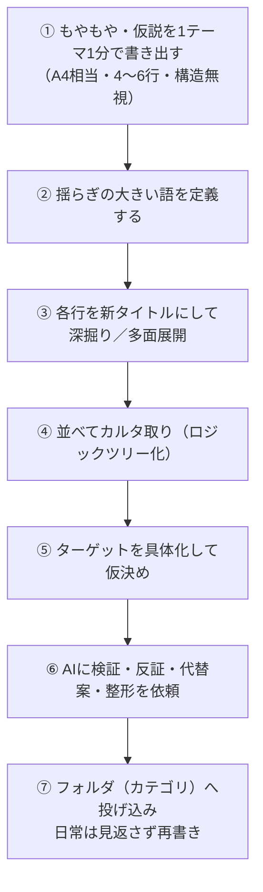

# 『ゼロ秒思考』引用抽出

作成日: 2026-08-02

## 目的

本書から、次の2点に直結する箇所を**要約ではなく引用**で取り出し、実務（ドメイン知識の解像度向上／「何を作るか」の明確化／AIと思考を深める）に転用できる根拠を残すことです。

読者が得られる成果は、章ごとの原文引用と、その引用を選んだ理由（観点への対応）をセットで参照できることです。

## 抽出の観点（フィルタ）

1. **ドメイン知識の解像度を上げ、「何を作るか」を明確にする**
2. **AIと思考を深めるアプローチのコツを掴む**

## 本書の章構成（PDFページ対応・確認済み）

| 区分 | 章 | タイトル | PDFページ目安 |
|------|----|----------|---------------|
| — | はじめに | （まえがき） | 6〜7 |
| — | 目次 | （構成一覧） | 8〜10 |
| — | 第1章 | 「考える」ためのヒント | 11〜23 |
| — | 第2章 | 人はゼロ秒で考えられる | 24〜45 |
| — | 第3章 | ゼロ秒思考をつくるメモの書き方 | 46〜98 |
| — | 第4章 | メモを使いつくす | 99〜137 |
| — | 第5章 | メモの整理・活用法 | 138〜154 |
| — | おわりに | （あとがき） | 155〜157 |
| — | 巻末 | 著者紹介／奥付 | 158〜161 |

※画像PDF（Kindleスクショ由来）からの読み取りのため、縦組みを横組みに再配置しています。細部の文言ズレがあり得る点にご留意ください。

## 凡例

- **引用**: 本文の文言（画像PDFからの読み取り。縦組みを横組みに再配置）
- **理由**: 上記2観点のどちらに効くか／どう転用するか
- **図**: 本書図・手順を Mermaid で再表現

---

## はじめに

- 引用：一生懸命考えているつもりで、実際は立ち止まっている、という人が意外に多い。前に進まない。あるいは、空回りする。
  - 理由：観点1。要件定義や企画が「考えている最中」に見えて前に進まない状態を、最初に切り分ける診断基準になるため。

- 引用：そもそも、大半の人は、どうすれば「深く考える」ことができるのかがよくわかっていない。「もっとよく考えてください」「この考えは浅いね」などと言われ、深く考えることを要求されていることはわかる。……みなその具体的な方法論を知らない。
  - 理由：観点1・2。「何を作るか」を詰める前に、思考の方法論そのものが未整備である点を明示するため。AIにも「深く考えて」とだけ頼む前に、方法を先に設計する根拠になるため。

- 引用：心の整理をし、考えをまとめ、深める方法があったら、誰でも別人のように成長できる。
  - 理由：観点2。深い思考は天賦ではなく方法で再現できる、という前提を置くと、AIを「代弁者」ではなく「訓練相手」に使えるため。

- 引用：それは、頭に浮かぶことを次々とメモに書くだけだ。ただ、ノートやパソコン上ではなく、A4の紙に1件1ページで書く。ゆっくり時間をかけるのではなく、1ページを1分以内にさっと書く。毎日10ページ書き、フォルダに投げ込んで瞬時に整理する。
  - 理由：観点1・2。「何を作るか」を詰める最小単位（1テーマ1ページ・1分）として、AIセッションも同粒度に区切る設計指針になるため。

- 引用：それだけで、マッキンゼーのプログラムでも十分に教えていない、最も基本的な「考える力」を鍛えられる。深く考えることができるだけでなく、「ゼロ秒思考」と言える究極のレベルに近づける。
  - 理由：観点1。高度な分析以前に、基本の思考運動がボトルネックである、という優先順位の根拠になるため。

- 引用：本書の第1章と第2章は、考えるためのヒントと「ゼロ秒思考」について解説している。一刻も早くメモ書きを実践したい、「ゼロ秒思考」に近づきたいという方は、第3章から読み始めてもらってもかまわない。
  - 理由：観点2。理論（第1〜2章）と実践（第3章以降）を分離できる。AIプロンプト設計も「概念理解→手順」に分けるとよいため。

### はじめにメモ（事実と意見の区別）

- **事実（本文に基づく）**: A4・1件1ページ・1分以内・毎日10ページ・フォルダ整理が中核手法として提示され、第3章からの読み始めも許容されている。
- **意見（転用仮説）**: AI対話の前段に「1テーマ1分の人間側メモ」を挟むと、プロンプトの解像度が上がりやすい、と推測されます。

---

## 第1章　「考える」ためのヒント

### 1-1. 頭に浮かぶイメージ・感覚を言葉にする

- 引用：「感情も言葉にできる」ということだ。そのうえで、頭に浮かぶイメージ、感覚を言葉にしてみよう。
  - 理由：観点2。AIに渡す前段として、非言語的な違和感・直感を言語化する工程を明示するため。

- 引用：頭の中はもやもやしていることが多い。いろいろな言葉が浮かぶ。言葉にならない言葉が浮かんでは消える。それを頑張って言葉にしてみる。浮かんだ瞬間に言葉にしてみる。
  - 理由：観点2。プロンプトの入力を「完成文」ではなく「浮かんだ断片の列」から始める運用に直結するため。

- 引用：言葉にしてみると言っても、頭で考えているだけだとふわふわしたままで明確にならないので、紙に書き出す。……「かまわず」というのは、人の名前も、欲望も憎しみも嫉妬も、全部そのまま書くという意味だ。
  - 理由：観点1・2。ドメインの曖昧さ（利害・感情・制約）を隠さず出すと、後段で「何を作るか」の論点が見えるため。

- 引用：誰だって、起きている間、いつでも何かを感じている。何かを考え、なんらかのイメージが浮かんでいる。ただ、それがすぐ消えてしまう。言葉を認識する以前に、もやっとした感情のまま、それが何かを特定しないまま消えてしまう。
  - 理由：観点1。要件の「言語化前に失われる情報」を、設計上の損失として認識するため。

- 引用：「こうしたら」という思い、アイデアが生まれる一方で、「でも、だめじゃないか」「そんなの無理に決まっている」「自分にはとてもできない」という気持ちも湧き起こってくる。……これも全部書き出すとよい。
  - 理由：観点1。アイデアと阻害要因を同時に可視化しないと、「何を作るか」が不安で縮むため。

#### 図：もやもや → 言語化 → 前進

---

### 1-2. 言葉を自由に、的確に使う

- 引用：イメージや感覚を言葉にすることに慣れてくると、だんだん自分の気持ちや思っていることをあまり苦労せずに表現できるようになる。言いたいことがすぐ出てくるので、ストレスが少ない。
  - 理由：観点2。AI対話でも「言葉にする筋」が先に育つと、プロンプト品質が安定するため。

- 引用：多くの仕事は、一つひとつの会話、メールのやり取りの積み重ねにより進んでいく。それらが正確に、余計な遠慮なくできれば前向きに進みやすい。
  - 理由：観点1。プロダクト開発も会話・ドキュメントの積み重ねであり、「遠慮による遅延」が要件悪化の主因になり得る、という診断になるため。

- 引用：遠慮が表現を阻害する。表現がうまくいかないと、考えること自体をあきらめてしまう。
  - 理由：観点2。AIに投げる前に「遠慮で思考停止」していないかを点検するチェックになるため。

---

### 1-3. 言葉の中心的意味と揺らぎ

- 引用：一つひとつの言葉には、それぞれ中心的な意味がある。その地域、時代、コミュニティ・仲間内で誰もがだいたい思い描く、理解にあまりギャップのない意味がある。
  - 理由：観点1。ドメイン用語の「共通理解レイヤー」を先に確認し、定義ズレを防ぐため。

- 引用：一方、「全力で」「責任感」「必ずやります」といった言葉の場合は、人によって意味がかなり異なる。それぞれの基準、価値観、背景、成功体験、失敗体験等に基づいてかなり幅があるからだ。
  - 理由：観点1。要件・SLA・「必ず対応」など解釈が割れる語を、作る前に定義し直す必要があるため。

- 引用：こうした意味の揺らぎがあるため、言葉への鋭い感覚を持ち、その場にあった的確な言葉使いをする人の話は非常にわかりやすい。定義が明確で、何を言っているかがよくわかり、一つひとつの説明が抵抗なくすっと頭に入ってくる。
  - 理由：観点1・2。AI出力の品質も「用語定義の明確さ」に依存する。プロンプトに定義表を添える設計指針になるため。

#### 図：言葉の揺らぎ

---

### 1-4. 浅い思考・空回りを避ける

- 引用：「考えが浅い」とは、文字通り深く考えておらず、表面的にしか考えていない状況だ。「それはどういう意味ですか？」と聞かれると、すぐ詰まってしまう。
  - 理由：観点1・2。AIに「深掘り質問役」をさせるとき、詰まる箇所＝定義未了の箇所として特定できるため。

- 引用：「空回り」とは、一つの課題について深く考え、より質の高い問題解決をすることなく、表面をなでて終わってしまうことだ。
  - 理由：観点1。議論・調査・プロトタイプが「進んでいる感」だけで本質に届いていない状態の名称になるため。

- 引用：思考やディスカッションが空回りすると、時間ばかりかけても、考えが前に進まない。深まらない。
  - 理由：観点2。時間投入量ではなく前進量でセッションを評価する運用原則になるため。

- 引用：黙考して考えがどんどん深まればいいが、ほとんどの人にとっては、ちょっとしたアイデアや不安が浮かんでは消え、浮かんでは消えで、ほとんど形にならない。書き留めないので蓄積されないし、アイデアも深まらない。
  - 理由：観点2。AIとの対話も、書き留め（ログ化）なしでは深まらない、という警告として転用できるため。

- 引用：アイデアを話してある程度反応がわかったら、話し続けるよりは一度切り。モードを変え、そこまでの考えを書き留め、仮説をさらに深めていくほうが、たいていの場合早く結果が出る。書くことで頭を一度整理し、そのうえでまた話をしてみる。PDCAを素早く回す形だ。
  - 理由：観点1・2。AI活用の基本ループ＝話す／出す→書く／固定→検証→再話す、として設計できるため。

- 引用：考えをすべて書き留めることだ。考えのステップ、頭に浮かんだことを書き留めると、堂々巡りがほぼなくなる。
  - 理由：観点1。企画・要件の分解（現状→原因→案→アクション）を、AIに渡すテンプレートにできるため。

### 第1章メモ（事実と意見の区別）

- **事実（本文に基づく）**: 第1章は「イメージ・感覚の言語化」「言葉の揺らぎ」「浅い思考／空回り」「書く→話すのPDCA」を中心に展開している。
- **意見（転用仮説）**: AI対話では、①もやもや断片の列挙 → ②揺らぎの大きい語の定義 → ③深掘り質問で詰まり箇所特定 → ④書き留めてから再対話、の順が整合しやすい、と推測されます。

---

## 第2章　人はゼロ秒で考えられる

### 2-1. 時間をかければ考えが深まるとは限らない

- 引用：徹底的に議論すると、充実した一日を過ごしたような気にはなる。ただ、それで今の企業に必要な意思決定のスピードを出せるのかというと、はなはだあやしい。
  - 理由：観点1。長期検討・大規模会議が「解像度向上」にならないケースを、設計レビューで警戒するため。

- 引用：一人の仕事でも同様だ。特にデスクワークの大半は悩んだり、堂々巡りしたりで時間を浪費する。
  - 理由：観点2。AI活用でも「完璧にしてから出す」ループに陥る。先に粗い案を出す必要性の根拠になるため。

- 引用：考えのプロセスを丁寧に教えてくれ、どうやったらもっとうまく考え、企画できるか教えてくれることはまずないだろう。当然、アウトプットの質が急激に上がるはずもない。
  - 理由：観点1・2。組織が教えない領域を、個人＋AIの習慣で補う設計が必要、という前提になるため。

- 引用：時間を2倍かけると2倍よい内容を考え出せるかというと、まずそんなことはない。
  - 理由：観点1・2。工数＝品質ではない。AIで量産→短サイクルで磨く方が合理的、という判断材料になるため。

---

### 2-2. 即断即決と仮説思考

- 引用：優れた経営者、優れたリーダーは、悩んだとしても、A案、B案、C案のメリット、デメリットが明確に頭の中にある。
  - 理由：観点1。作るものの選択肢を、比較可能なオプション集合として保持する状態が理想、という基準になるため。

- 引用：普段からその問題について考え続けているからだ。必要な情報収集も怠らない。常に感度が高く、アンテナが強力に立っている。最善のシナリオ、最悪のシナリオも常に考えている。
  - 理由：観点1。ドメイン解像度は「その場の調査」だけでなく、常時のアンテナ＋シナリオ保持で上がるため。

- 引用：どんなことに対しても、「これはこうかな」という仮説を立てている。あるいは立てることがすぐできる。仮説は立てた後で検証する。検証して違っていれば、すぐ立て直す。このスピードが非常に速く、かつ迷走しない。
  - 理由：観点1・2。AI対話の基本形＝仮説提示→反証／補強→修正。探索を止めず迷走も防ぐため。

#### 図：仮説 → 検証ループ

---

### 2-3. 究極はゼロ秒思考

- 引用：思考の「質」と「スピード」、双方の到達点が「ゼロ秒思考」だ。
  - 理由：観点1。速さだけ・深さだけのどちらか片方では不十分、という完成定義のため。

- 引用：ゼロ秒とは、すなわち、瞬時に現状を認識し、瞬時に課題を整理し、瞬時に解決策を考え、瞬時にどう動くべきか意思決定できることだ。迷っている時間はゼロ、思い悩んでいる時間はゼロとなる。
  - 理由：観点1。インシデント対応・要件変更時の理想状態を、4ステップで記述できるため。

- 引用：今、目の前で何が起きているのか、どういう現象なのか、一瞬のうちに判断し、判断したら次の瞬間に進むべき道を複数考え、長所短所の比較をし、即座に方針を決定することができるようになる。
  - 理由：観点1・2。AIに「現状認識→複数案→比較→方針」の順で出力させるプロンプト構造の根拠になるため。

#### 図：ゼロ秒思考の4ステップ

---

### 2-4. ゼロ秒思考と情報収集

- 引用：大半の人が調べすぎてしまう。何週間も延々と調べる。それ自体はもちろんよいことだが、時間がかかるばかりで判断・決断を延ばしがちだ。
  - 理由：観点2。AIリサーチも「調べ続けて決めない」罠がある。上限と出口（仮説確定）が必要なため。

- 引用：「もっと情報がほしい、今のままだと不完全だ」という気持ちをこらえて、大胆に仮説を出す所をつける。それだけで、仮説構築のスピードと質は劇的に高まる。
  - 理由：観点1。MVP・要件ドラフトも「不完全でも出す」が先。AIに粗案生成を任せる正当化になるため。

- 引用：仮説はあくまでも仮説にすぎず、出した仮説の根幹だけはすぐ確認、検証しておく必要がある。
  - 理由：観点1。速さと鲁莽の境界。作るものの根幹仮説だけは早期検証、というリスク管理原則になるため。

---

### 2-5. ゼロ秒思考はメモ書きで身につける／効能

- 引用：ゼロ秒思考はメモ書きで身につける。
  - 理由：観点2。到達手段が「才能」ではなく「メモ書きの習慣」であると明言されているため。

- 引用：具体的には、A4用紙を横置きにし、1件1ページで、1ページに4〜6行、各行20〜30字、1ページを1分以内、毎日10ページ書く。
  - 理由：観点1・2。AIセッションの前後に、人間側で1分メモを挟む習慣＝思考の解像度を上げる最小プロトコルになるため。

- 引用：もやっとした思いを言葉に直し、手書きし、目で確認することで、メモが外部メモリになる。そうすると、驚くほど頭の働きがよくなる。
  - 理由：観点2。頭の作業記憶を外部化し、AIには整形・反証・構造化を任せる役割分担の根拠になるため。

- 引用：なんとなく考えていたこと、なんとなくできていたこと、すなわち「暗黙知」がはっきりと形になる。つまり「形式知」化する。
  - 理由：観点1。作るものの仕様・判断基準を、暗黙知→形式知に落とすプロセスの名称として使えるため。

- 引用：メモ書きによって、自分の置かれた状況、目の前の課題が素早く可視化され、優先順位も自ずと明確になる。
  - 理由：観点1・2。可視化→優先順位→行動、というプロダクト開発のメンタルモデルと一致するため。

#### 図：メモ書きの基本ルール（第2章）

### 第2章メモ（事実と意見の区別）

- **事実（本文に基づく）**: 時間≠深さ、仮説→検証、ゼロ秒思考の4ステップ、メモ書きの具体ルール（A4／1分／10ページ等）が提示されている。
- **意見（転用仮説）**: AI活用は①1分メモで自分の仮説を先に出す → ②AIに検証・反証・代替案を依頼 → ③根幹だけ早期確認、の3点が整合しやすい、と推測されます。

---

## 第3章　ゼロ秒思考をつくるメモの書き方

### 3-1. タイトル／本文／フォーマット

- 引用：メモを書く際は、A4用紙を横置きにし、左上にタイトルを書いて下線を引く。……1ページにびっしり書くのではなく、わずか4〜6行のみ書いて終わりにする。
  - 理由：観点1。成果物の最小単位（1テーマ＝1枚＝短い本文）が定義され、AI対話でも「1問1枚」の粒度設計に転用できるため。

- 引用：メモ書きはタイトル、日付、本文までの全部を1ページ1分以内に書くというスピード重視なのである。
  - 理由：観点2。完成度より初速。AIへの中間出力も「1分相当の短さ」で出す運用原則になるため。

- 引用：頭に浮かんだ言葉そのものをタイトルにする。むずかしく考えることは何もない。むずかしく考えてはいけない。
  - 理由：観点2。プロンプト設計前の「ラベル付け」を過剰最適化しない原則のため。

- 引用：昨日どう書いたかなどと見返す必要はない。見返さず、頭に浮かんだまま、また書く。
  - 理由：観点2。履歴参照より「空で書き直す」方が整理に効く、という運用仮説の根拠になるため。

- 引用：メモの本文は4〜6行を原則としている。……だらだらと書き続けると、大事なことも大事でないことも書き連ねてしまう。
  - 理由：観点1。1枚あたりのスコープ上限＝優先順位の強制。「何を作るか」の論点を絞る装置になるため。

- 引用：気になることは先に頭に浮かんできて、それが重要なことだからだ。ほとんどの場合、ばっと思いつき、ぱっぱっと書いた順に重要な点を書くことができる。
  - 理由：観点1・2。書く順序＝重要度順という暗黙ルール。AIへの箇条書き提示順もそのまま使えるため。

- 引用：メモのフォーマットは必ず守る。まずは、フォーマットに関しての工夫よりも、内容に注力してもらいたい。
  - 理由：観点1。「何を作るか」の前に容器を固定する。ツールやUIを変えるよりフォーマット遵守が先、という実装順序の指針になるため。

#### 図：A4メモ1枚のレイアウト

---

### 3-2. なぜノート／日記／Wordではだめか

- 引用：整理や体系化にまったくエネルギーを使わない。これが非常に大きい。企画書を書くのに結構な時間とエネルギーを取られるのは、整理して書かないといけないと思い、体系化しようとし、それらがストレスとなって頭の働きが鈍るからだ。
  - 理由：観点1・2。第1フェーズは「吐き出しのみ」、第2フェーズで並べて構造化（第4章）という二段設計の根拠になるため。

- 引用：1件1ページで完結しているので、前後関係も気にする必要がなく、形式にとらわれることがない。目次も順番もない。浮かんだまま書き留めていく。
  - 理由：観点2。AIとの対話ログも時系列依存にせず、テーマ単位の独立カードとして扱う設計に対応するため。

- 引用：何より問題は、思いついたことを書くのはいいが、整理がまったくできないことだ。時系列に書きためていくだけなので、似たようなことを数日か数週間おいて書いた場合、整理のしようがない。
  - 理由：観点1。ノート型（時系列バインダー）を避ける理由＝「何を作るか」がテーマ横断で見えなくなるため。

- 引用：パソコンの場合は文字で書けることしか考えなくなる点も問題だ。図を描くほうがはるかにてっとり早いことも、すべて文字表現だけで済まそうとすることになる。文字で表現しづらいことは自然に端折ってしまう。
  - 理由：観点1・2。テキスト偏重で図・関係が落ちる。AI出力も最初はテキストだけに偏らないよう、「並べ・描く」工程を残す示唆のため。

---

### 3-3. 毎日10ページ／思いついた瞬間／感情→考え→メモ

- 引用：毎日10ページだと、2週間で140ページ、1ヶ月で300ページ、半年で1800ページになる。わずか1分で書く簡単なメモでも、これだけ書くとすごいことになる。
  - 理由：観点1。日次10枚の積み上げがドメイン理解の物理的証拠になる、というスケール感のため。

- 引用：大切なのは、メモは思いついたその場ですぐに書くことだ。夜寝る前にまとめて10ページではなく、原則、思いついたその瞬間だ。
  - 理由：観点2。AIも「バッチ要約」より「気づき即キャプチャ」が鮮度を保つ、という運用原則のため。

- 引用：アイデアとは一期一会なのだと考えている。頭の中に浮かぶアイデア・懸念との出会いは二度とないかもしれないので、その場ですぐ書き留めるということだ。
  - 理由：観点2。セッション跨ぎで失われる中間思考を、都度外部化する必要性の説明のため。

- 引用：感情を考えに、考えをメモに。
  - 理由：観点2。感情→思考→外部化の順序。AIに投げる前に感情を思考へ変換するステップを残すため。

### 第3章メモ（事実と意見の区別）

- **事実（本文に基づく）**: A4横・1件1ページ・4〜6行・1分以内・毎日10ページが基本。ノート／日記／PCは著者非推奨。似タイトルは見返さず書き直す。
- **意見（転用仮説）**: AIには「タイトル＋4〜6行・構造無視」で出させ、整形は第2ラウンドに回す運用が本書と整合しやすい、と推測されます。

---

## 第4章　メモを使いつくす

### 4-1. 深掘りと多面的な書き方

- 引用：メモによっては、1ページに書いた4〜6行それぞれをタイトルとして、さらに4〜6ページのメモを書くと考えが非常に深まり、整理される。内容が一段も二段も濃くなって、いっそうすっきりする。
  - 理由：観点2。1枚目は入口、続けて深掘りすると思考が段階的に精緻化する、という多ターン対話モデルの根拠になるため。

- 引用：1つのタイトル（＝テーマ）を深掘りすると、あっという間にむずかしい問題が小分けにされ、分解して整理でき、同時に全体像が頭に入るという大きなメリットが期待できる。
  - 理由：観点1。「何を作るか」をロジックツリー化する前段階として、問題を小分けにする効能の説明のため。

- 引用：多面的にメモを書くと、相手の立場で物を考えることができるので、相手の見方、行動の理由が書く前に比べて理解しやすくなる。
  - 理由：観点2。AIへの「ステークホルダー別に同テーマを書け」というマルチ視点プロンプトの理論的根拠になるため。

- 引用：メモは深掘りにせよ、多面的な書き方にせよ、調子が出た時は、1日10ページに制限することなく、どんどん書き続けるのがよい。
  - 理由：観点2。通常10枚／日、深掘り時は15〜20枚まで許容。AIセッションも「調子時は枚数上限を外す」運用指針になるため。

- 引用：1ページ1分で書けるようになっていると、ここまでせいぜい15〜20分しかかからない。
  - 理由：観点1。1テーマ深掘りの工数見積もり（15〜20枚＝15〜20分）。スプリント計画の根拠になるため。

#### 図：1枚からの深掘り（再帰展開）

---

### 4-2. メモとロジックツリー／企画書化

- 引用：メモの場合は、構造等をまったく考えず、思いついたものをひたすら書くことができ、後から並べてみると、自然とロジックツリーのように整理されたものになる。
  - 理由：観点1・2。トップダウンでツリーを描かず、ボトムアップで並べて構造が見える。AI生成物の後処理（カードソート）手法の根拠になるため。

- 引用：まっさらな状態で考えをツリー状に整理することは簡単ではないし、時間を取られる。メモであれば、1ページ1分でただ書いていれば自然に構造が見えてくる。
  - 理由：観点1。「何を作るか」の骨格を先に作らず、素材を先に大量生成する企画手法の正当化のため。

- 引用：思いついた片っ端から数十ページ書き殴る。構造は完全に無視。
  - 理由：観点1・2。フェーズ1の成果物定義＝構造なしの大量メモ。AIへの「とにかく案だけ出す」指示と同型のため。

- 引用：カルタ取りのように並べてみる。
  - 理由：観点1。物理／画面上の配置が発見を生む。ホワイトボードやFigJamでのカード配置レビューに相当するため。

- 引用：ポイントは、「考えずに」書くことだ。感じるまま、頭に浮かぶまま、一瞬時に書き留めていく。構造やわかりやすさ、起承転結等いっさい気にする必要がない。
  - 理由：観点2。AIプロンプトでも第1ラウンドは評価・構成を禁止し、発散のみ、というルールの根拠になるため。

- 引用：ターゲットユーザー・顧客は、だいたいこのくらいではなく、できるだけ具体的に、鮮明に決めておく。アイデアごとにターゲットがかなり違うのが普通だ。
  - 理由：観点1。「何を作るか」のWho定義。AI要件定義で最もズレやすい点を明示しているため。

- 引用：自分は「20代女性」を対象にしていたつもりなのに、チームは「20代後半中心…」を対象にしていた、という初歩的ミスも大いに起こりうる。
  - 理由：観点1。ターゲットの口頭暗黙知がチーム間でズレる典型例。AI共有前にメモで具体化すべき理由のため。

- 引用：企画書の骨子ができたら、初めてパワーポイントの出番だ。机の上に並べたメモを見ながら、表紙、目次ページ、各章のページを作っていく。
  - 理由：観点1。成果物パイプライン（メモ→並べる→PPT）の順序固定。AIは最終整形段階に回す設計のため。

- 引用：メモ書きは一人で実施するだけではなく、チームメンバー全員で取り組むと、さらに大きな成果が期待できる。共通言語ができるので意思疎通が素早くなる。
  - 理由：観点1・2。チーム全員が同フォーマットで書く＝共通言語。AIプロジェクトでも全員が同型メモを書く運用に転用できるため。

#### 図：メモから企画書を作るステップ

- 図の根拠（本文キャプション）：書いたメモ書きを並べていく／メモから企画書をまとめる。
  - 理由：観点1。空間配置で「何を作るか」の骨格が見える、という本書の中核手順のため。

### 第4章メモ（事実と意見の区別）

- **事実（本文に基づく）**: 深掘りは各行を新タイトルにして拡張。企画書は大量生成→並べる→仮決め→PPT転写の順。ターゲット具体化を強調。
- **意見（転用仮説）**: AI協働では、第1ラウンド発散→各行を深掘りタイトル化→カードソート→骨子確定、の順が本書の写経に近い、と推測されます。

---

## 第5章　メモの整理・活用法

### 5-1. クリアフォルダ分類

- 引用：うまくカテゴリーを分けて整理すると、さらに頭の整理が進む。一番効果的なのは、クリアフォルダを使う方法だ。
  - 理由：観点1。思考の外部表現＝フォルダ分類。プロジェクトのドメイン境界設計に類比できるため。

- 引用：毎日10ページのメモを書くと、2週間で140ページになる。これを放置すると収拾がつかなくなるので、書き始めて4〜5日したところで、5〜10個程度のカテゴリーに分けることをお勧めしている。
  - 理由：観点1。フォルダ設計の開始タイミング（4〜5日目）とカテゴリ数（5〜10）という具体パラメータのため。

- 引用：毎晩寝る前にメモをフォルダに振り分ける際、どちらのフォルダに入れるべきか迷うメモが何度か出てきたら、そのシグナルだ。
  - 理由：観点1。分類体系の見直しトリガー＝「迷い」の発生。ドメインモデル再設計のシグナルとして転用できるため。

#### 図：クリアフォルダ分類（著者例のイメージ）

---

### 5-2. メモのその後（見返さない／3ヶ月見直し）

- 引用：カテゴリーごとにメモを投げ込んだクリアフォルダには、ただ貯め込んでおけばよい。……一々見直さなくても空で書き続けることで、頭は急激によくなっていく。回転するようになる。
  - 理由：観点2。日常は「見返さない／投げ込むのみ」。AIログも毎回全履歴読み返さず、新規生成で整理する方針の根拠になるため。

- 引用：以前どういうことを書いたか見直すのではなく、新たに書き直すほうがよい。……気になるテーマ、タイトルに関し、何度も繰り返して書く、ということが実は何より重要な練習になる。
  - 理由：観点2。アーカイブ参照より「同テーマの再書き」が学習効果大。AIにも「過去ログ要約」より「同問いを再生成」させる示唆のため。

- 引用：そのくらい書くと内容を完全に把握し、非常にすっきりとした状況になる。頭の中が完全に整理された形だ。
  - 理由：観点2。1テーマを何度も書き直すと「把握完了」に達する、という完了条件の定義のため。

- 引用：自分の成長過程を確認するためにも、3ヶ月に一度さっと見るとよい。……数分で流し読みするだけだ。それで十分である。
  - 理由：観点1・2。例外としての3ヶ月レビュー（流し読みのみ）。プロジェクト振り返りの最小頻度・最小深度の参照になるため。

- 引用：さらに3ヶ月後（メモを書いてから6ヶ月後）にまた追加されたメモを整理し、前回読み返した部分をもう一度だけ見直す。
  - 理由：観点2。6ヶ月後の第2回レビューで「内面化確認」。学習が定着したかの検証タイミングのため。

- 引用：メモは書いてから6ヶ月たてば、見返す必要はもうない。しかしメモの存在そのものが思考の積み重ねの証であり、自信の源になるはずだ。
  - 理由：観点1・2。保管はするが日常参照は不要、というライフサイクル終端。ナレッジベースの「参照」と「存在証明」の分離のため。

- 引用：気をつけるべきは、他人に見られないようにすることだ。メモには不満や問題意識もすべてはき出している。人の名前も入っている。
  - 理由：観点1。プライベートな思考ログの取り扱い。AI共有時のマスキング・ローカル保管の必要性のため。

#### 図：メモのライフサイクル

### 第5章メモ（事実と意見の区別）

- **事実（本文に基づく）**: 4〜5日目から5〜10カテゴリのクリアフォルダ分類。日常は見返さない。3ヶ月・6ヶ月に限定レビュー。
- **意見（転用仮説）**: AIログも「毎日ダンプ＋ラベル」「四半期で流し読み」「日常は再生成優先」が整合しやすい、と推測されます。

---

## おわりに

- 引用：大多数の人は、まとめようとすると頭が動かなくなる。まとめようとせず、考えようともせず、感じたままをメモにはき出すことで、いくらでも思考が進むことを説明してきた。
  - 理由：観点2。本書全体の結論＝「要約・構成」より「感じたまま外部化」。AIにも最初から要約させない運用の根拠になるため。

- 引用：その究極が「ゼロ秒思考」だ。考えるということに対して、苦手意識がなくなり、現状把握も課題整理も実際の行動に関しても、すっと浮かぶようになる。
  - 理由：観点1・2。ゼロ秒思考の定義＝思考への抵抗消失＋即座の現状・課題・行動の浮上。AI協働の到達状態の説明に使えるため。

- 引用：毎日10ページのメモ書きを数ヶ月続けていくと、この「ゼロ秒思考」の感覚がだんだんとわかってもらえるようになると思う。
  - 理由：観点2。到達感の条件＝10枚／日×数ヶ月。習熟期間の目安になるため。

- 引用：メモ書きの有効性は日本語に限らない。……英語でメモ書きをする場合も、日本語とまったく同じフォーマット、同じ書き方だ。
  - 理由：観点1・2。言語非依存のプロトコル。AIとの英語思考セッションでも同一フォーマットを適用できるため。

### おわりにメモ（事実と意見の区別）

- **事実（本文に基づく）**: 「ゼロ秒思考」を再定義し、10ページ／日×数ヶ月を到達条件として述べている。英語でも同フォーマットと明言。
- **意見（転用仮説）**: 「ゼロ秒思考」は定性的な到達感であり、客観測定指標は本書では示されていない点に留意が必要です。

---

## 全体メモ（転用仮説）

本書全体を、観点1・2に沿って運用する場合の仮説手順です（本文の断定ではなく転用意見）。

---

## 進行状況

- [x] はじめに
- [x] 第1章
- [x] 第2章
- [x] 第3章
- [x] 第4章
- [x] 第5章
- [x] おわりに

全章の引用抽出を完了しました。
