# 『「言葉にできる」は武器になる。』引用抽出

作成日: 2026-08-02

## 目的

本書から、次の2点に直結する箇所を**要約ではなく引用**で取り出し、実務（ドメイン知識の解像度向上／「何を作るか」の明確化／AIと思考を深める）に転用できる根拠を残すことです。

読者が得られる成果は、章ごとの原文引用と、その引用を選んだ理由（観点への対応）をセットで参照できることです。

## 抽出の観点（フィルタ）

1. **ドメイン知識の解像度を上げ、「何を作るか」を明確にする**
2. **AIと思考を深めるアプローチのコツを掴む**

## 本書の章構成（PDFページ対応・確認済み）

| 区分 | 章 | タイトル | PDFページ目安 |
|------|----|----------|---------------|
| （第1部） | 第1章 | 「内なる言葉」と向き合う | 1〜30 |
| （第1部） | 第2章 | 正しく考えを深める「思考サイクル」 | 31〜79 |
| （第1部） | 第3章 | プロが行う「言葉にするプロセス」 | 80〜85 |
| 戦略 | 戦略1 | 日本語の「型」を知る | 86〜110 |
| 戦略 | 戦略2 | 言葉を生み出す「心構え」を持つ | 111〜133 |
| — | おわりに | （あとがき） | 134 |
| — | 巻末 | 参考文献／著者紹介／奥付 | 135〜138 |

※画像PDFからの読み取りのため、縦組みを横組みに再配置しています。細部の文言ズレがあり得る点にご留意ください。

## 凡例

- **引用**: 本文の文言（画像PDFからの読み取り。縦組みを横組みに再配置）
- **理由**: 上記2観点のどちらに効くか／どう転用するか
- **図**: 本書図を Mermaid で再表現

---

## 第1章　「内なる言葉」と向き合う

### 1-1. 伝わり方のレベル（解像度の段階）

- 引用：「伝わった」という状況は、この両者、つまり、話す側と聞く側、書く側と読む側の共同作業によってもたらされるのだ。
  - 理由：観点2。AIとの対話も「共同作業」として設計すべきで、一方通行のプロンプト投げでは「伝わった」に到達しにくい、という運用原則になるため。

- 引用：そもそも話が伝わっていない、もしくは、内容が誤って伝わっている状態。伝えた側と伝えられた側に、認識のズレが生じている。（不理解・誤解）
  - 理由：観点1。要件・ドメイン定義が曖昧なとき、まず「認識のズレ」状態かを診断する基準になるため。

- 引用：伝えた内容が、過不足なく伝わっている状態。相手が話したことをヌケモレなく正しく把握している。しかし、「頭では分かっているが、心がついていかない」といった状況にも陥りやすい。（理解）
  - 理由：観点1。ドメインを「説明できる」だけでは不十分で、「何を作るか」へのコミット（納得）に達していない状態を切り分けるため。

- 引用：相手が話したことを、頭で理解しただけでなく、内容が腹に落ちている状態。（納得）
  - 理由：観点1。「何を作るか」を決める閾値を、「理解」ではなく「納得」に置く判断基準になるため。

- 引用：見聞きした内容を理解した上で、心が動かされ、自らの解釈が加わっている状態。相手の意見や感情などに「その通りだ」と感じ、自分なりの考えを加えたり、自分にもできることがないかと協力を申し出るといった行動を起こしたくなる。（共感・共鳴）
  - 理由：観点1・2。プロダクト定義やAI対話の到達点を「正しい要約」ではなく「解釈が加わり行動が起きる」レベルに設定する指標になるため。

#### 図：伝わり方のレベル

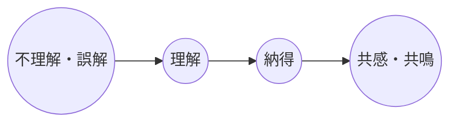

- 図の根拠（本文キャプション）：伝わり方にはレベルがある。
  - 理由：観点1。ドメイン解像度を「伝わった／伝わっていない」の二値ではなく、段階として管理する枠組みになるため。

---

### 1-2. 内なる言葉／外に向かう言葉（思考と表現の二段階）

- 引用：言葉が意見を伝える道具であるならば、まず、意見を育てる必要がある。
  - 理由：観点1。「何を作るか」（意見）を育てずに表現技法だけ整えると、成果物の芯が空洞になる、という順序原則のため。

- 引用：言葉を生み出す過程には、①意見を育てる、②意見を言葉に変換する、という二段階が存在する。
  - 理由：観点2。AI活用でも「②変換（文章化・コード化）」に偏りがちなので、①を明示的な工程として残す設計指針になるため。

- 引用：考える＝内なる言葉を発している。
  - 理由：観点2。思考を「曖昧な脳内処理」ではなく「内なる言葉の発話」として扱うと、AIへの中間出力（箇条書き・断片）が設計しやすくなるため。

- 引用：考えているのではない。頭の中で「内なる言葉」を発しているのだ。
  - 理由：観点2。メタ認知のスイッチ。「今どの内なる言葉が出ているか」を観測対象にすると、AI対話の問いが具体化するため。

- 引用：「内なる言葉」で意見を育て、「外に向かう言葉」に変換せよ。
  - 理由：観点1・2。ドメイン定義（内）→仕様／プロンプト／説明（外）という変換パイプラインの骨格になるため。

- 引用：頭に浮かぶあらゆる感情や考えは、この「内なる言葉」によってもたらされている。その事実に気が付き、意識を向けることが、あらゆる行動の源泉となる思考を豊かにすることに寄与する。
  - 理由：観点2。AIと深掘りする前に、自分側の源泉（感情・仮説・違和感）を観測する習慣が先、という順序になるため。

- 引用：使う言葉を変えたわけではない。小手先の言葉の技術を学んだわけでもない。常に頭の中に浮かぶ「内なる言葉」の存在に意識を向け、「内なる言葉」を磨く鍛錬を積んだだけである。
  - 理由：観点2。「プロンプト技術」単体では限界があり、入力側の思考鍛錬が品質を決める、という本書の中核主張のため。

#### 図：内なる言葉 → 外に向かう言葉

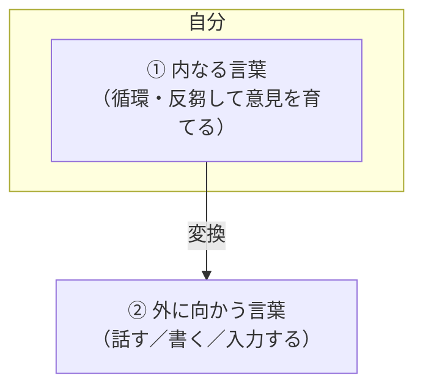

- 図の根拠（本文キャプション）：「内なる言葉」を育て、「外に向かう言葉」に変換する。
  - 理由：観点1・2。「何を作るか」は①で育ち、②は伝達・実装の変換層、と役割分担できるため。

---

### 1-3. 「考えたつもり」からの脱却（解像度不足の正体）

- 引用：「内なる言葉」は、単語や文節といった短い言葉であることが多く、頭の中で勝手に意味や文脈が補完されることで、あたかも一貫性を持っているかのように錯覚してしまうからである。
  - 理由：観点1。ドメイン知識が「頭の中では分かっている」のに仕様が揺れる典型原因（脳内補完による一貫性の錯覚）を説明するため。

- 引用：言葉にできないということは「言葉にできるほどには、考えられていない」ということと同じである。
  - 理由：観点1・2。言語化できない要求を「まだ解像度不足」と診断するチェックリストになるため。AIに投げる前の自己判定にも使える。

- 引用：全てを理解していなければ、言葉にできない。
  - 理由：観点1。全体像（パズルの全ピース）が揃っていない段階では、「何を作るか」を確定宣言できない、という制約条件になるため。

- 引用：「自分は今、内なる言葉を用いて思考している」と認識し直すことで、頭の中にある漠然としたものが一気に明確になり、深く考える糸口を見つけることができるようになるのだ。
  - 理由：観点2。AI対話の開始プロトコルとして「今の内なる言葉を列挙する」一手が導けるため。

- 引用：「内なる言葉」に幅と奥行きを持たせることが、よく考えることの正体である。
  - 理由：観点1・2。「よく考える」＝横（幅）と縦（深さ）を増やす、と定義でき、後章の「横のライン／縦のライン」へ接続するため。

#### 図：理解不足と言語化失敗

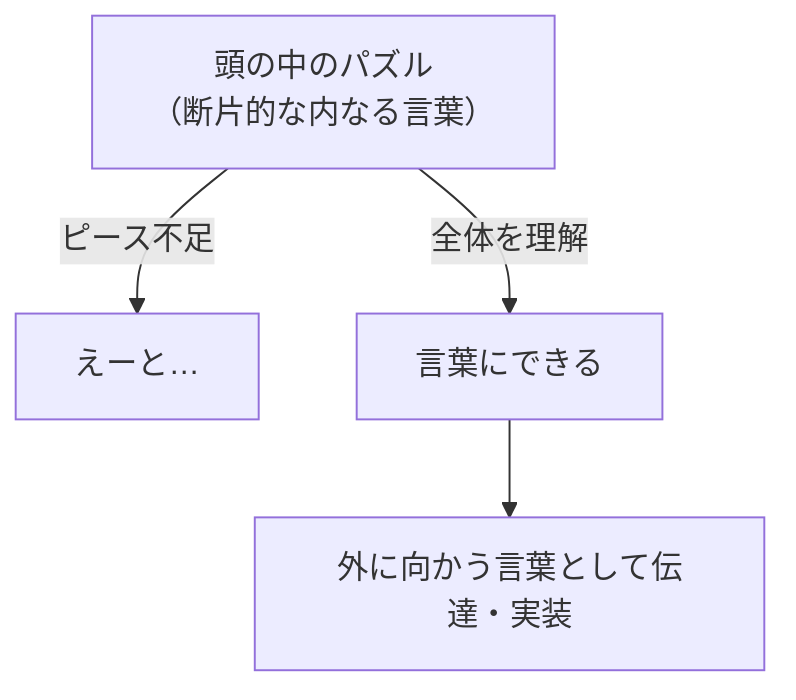

- 図の根拠（本文図の趣旨）：全てを理解していなければ、言葉にできない。
  - 理由：観点1。ドメインの抜けを「言語化できない箇所」から逆探知する手順が取れるため。

---

### 1-4. スキル偏重の限界／視点としての内なる言葉

- 引用：スキルはあくまでも、その人自身の経験から抽出された方法論であって、同じ経験をしていない第三者が真髄までを理解することはできない。
  - 理由：観点2。AIが出す「テンプレ話法」や他人のフレームワークをそのまま適用しても、自分のドメイン体験がなければ解像度が上がらない、という注意点のため。

- 引用：外に向かう言葉だけをどんなに鍛えたところで、言葉の巧みさを得ることはできるかもしれないが、言葉の重さや深さを得ることはできない。
  - 理由：観点1・2。表現力向上とドメイン深度は別変数である、と分離できるため。

- 引用：気持ちと言葉が一致していなければ、言葉と行動が一致するはずもない。
  - 理由：観点1。プロダクト方針と実装・運用行動のギャップを、「内なる言葉の未整備」から説明する指標になるため。

- 引用：「内なる言葉」とは、あなたの視点そのものである。
  - 理由：観点1。「何を作るか」は機能一覧ではなく視点（切り口）の選択である、と再定義できるため。

- 引用：ある出来事に対して、どういう感情が生まれるのか。そして、どういった内なる言葉が生まれるのか。つまり、あるインプットに対して、どういった感情をアウトプットするのか。
  - 理由：観点2。AIと深掘りするときの観測フォーマット（入力→感情→内なる言葉）になるため。

- 引用：さもなければ、『こうしなければならない』といった本当の気持ちではない『あるべき自分』から発せられる建前が先行し続けることになる。こうした建前を突き破ることができなければ、あなたの言葉はいつまでもどこかで借りてきたようなものになってしまい、迫力も説得力もないものになってしまう。
  - 理由：観点1。ドメイン方針を「べき論」で埋めず、自分の観測・体験に根ざした「作る理由」へ落とすための警告のため。

---

### 1-5. 「人を動かす」から「人が動く」へ（何を作るかの設計思想）

- 引用：人を動かすことはできない。より正確に表現するならば、「人が動きたくなる」ようにしたり、「自ら進んで動いてしまう」空気をつくることしかできないのだ。
  - 理由：観点1。作る対象を「強制の仕組み」ではなく「動きたくなる空気（文脈・体験）」として定義し直す指針になるため。

- 引用：「人を動かす」ことと「人が動く」ことは、同じように感じられるが、似て非なるものである。前者の「人を動かす」は自分の意図するように仕向けるといった強制的かつ受動的な意味合いが強いが、後者の「人が動く」は自らの意志で動き出すといった自主的かつ能動的な行動を促すものになっている。
  - 理由：観点1。機能要件を書くとき、「強制」と「自発」のどちらを設計しているかを点検する基準になるため。

- 引用：船を造りたいのなら、男どもを森に集めたり、仕事を割り振って命令したりする必要はない。代わりに、広大で無際限な海の存在を説けばいい。（サン＝テグジュペリ）
  - 理由：観点1。「何を作るか」をタスク分解の前に、共有すべきビジョン（海）として言語化する必要性を示すため。

- 引用：「伝わる」と「動きたくなる」の間にあるもの。その差を生んでいるのは、志を共有しているかどうかであると考える。
  - 理由：観点1。仕様が伝わっても採用・行動が起きないとき、不足しているのは説明ではなく「志の共有」だと診断できるため。

- 引用：自分の考えに確固たる自信を持つためには、考えを深めることが必要不可欠だ。そのためには、内なる言葉に意識を向けることで自分が考えていることを反芻し、本当にやりたいと思っていることは何か、成し遂げたいことは明確かを、自身に問いかけ、答えを出し続ける必要がある。
  - 理由：観点1・2。「何を作るか／成し遂げたいことか」を、内なる言葉への反復質問で解像度を上げる具体手順になるため。AIへの問いとしても転用可能。

- 引用：「何をするか？」「なぜするのか？」といった基本的な内容だけを伝えるだけではなく、「なぜ本気でそう思うのか？」「その結果、どうしたいか？」「なぜあなたを誘うのか？」といった、より具体的な自分の価値観にまで踏み込んでいく必要がある。
  - 理由：観点1。プロダクト／提案の定義質問セットとして、そのまま使えるため。

- 引用：考えた時間の単純な積み重ねではなく、正しく内なる言葉と向き合った量、つまり思考量によってのみ、心から伝えたいことが生まれ、言葉に変化が表れる。
  - 理由：観点2。AIとの往復回数や作業時間ではなく、「内なる言葉と向き合った量」をKPIにする発想になるため。

#### 図：動機付け → 動きたくなる


- 図の根拠（本文キャプション）：「動きたくなる空気をつくらなければ、人は動かない。」
  - 理由：観点1。作るべきものは機能そのものより「動きたくなる空気」である、という設計焦点を示すため。

#### 図：コミュニケーションのタイプ（上手さ × 重さ）

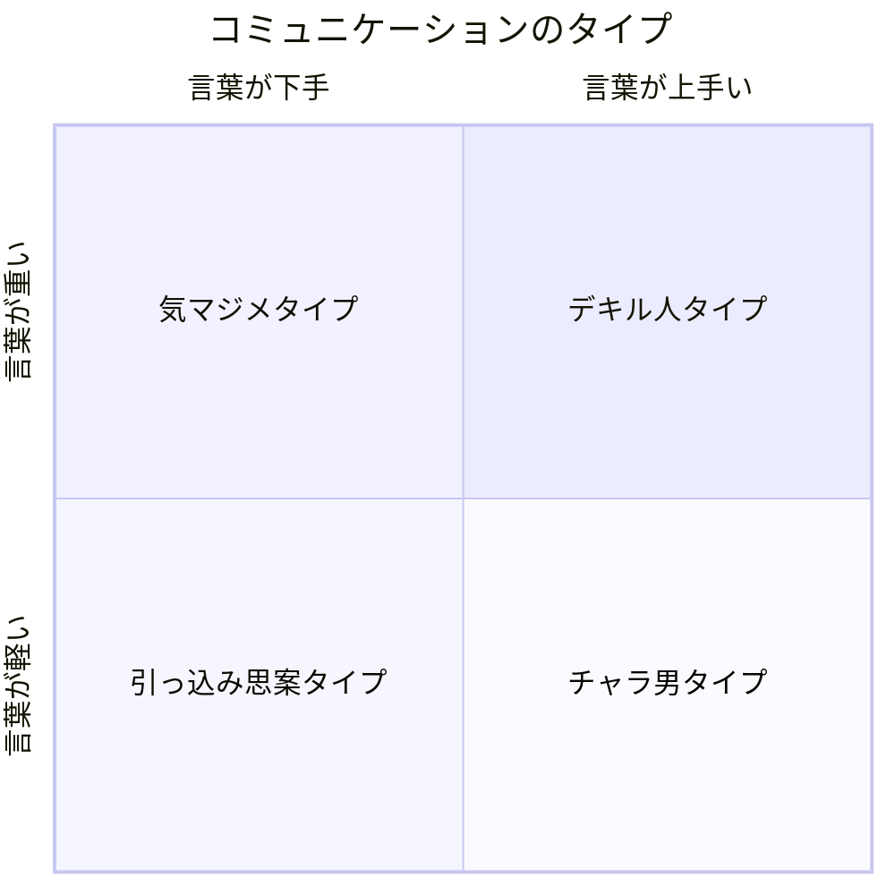

- 図の根拠：本文「コミュニケーションのタイプ」（言葉の上手さ／言葉の重さ、本心／本心ではない）。
  - 理由：観点1・2。磨くべき主軸は「上手さ」より「重さ（本心・思考の深さ）」であり、AIで文章を上手くしても重さは自動では増えない、と分離するため。

---

### 1-6. 習慣化：見える化とメタ認知

- 引用：「内なる言葉」に意識を向け続ける習慣こそが重要である。
  - 理由：観点2。単発の良いプロンプトより、内なる言葉を観測し続ける習慣が思考深度を決める、という運用原則のため。

- 引用：内なる言葉に意識を向け続けていれば、自分だけが持っている視点に気付くことができるようになるまでに、そう時間はかからない。すると、自然と「今自分の頭にはこんな言葉が浮んでいる」と認識し、自分の考え方のクセや思考を把握できるようになり、常に「自分の頭を覗いているもう一人の自分」の存在を意識できるようになる。
  - 理由：観点2。AIを「もう一人の自分（観測者）」として置く役割設計の根拠になるため。

- 引用：頭の中に浮かぶ言葉をそのままにしておくことなく、単語でも箇条書きでも紙に書いて、見える化する。すると、考え足りないところが見つかったり、自分の考えていることが表現しきれていない箇所に気付くことができる。あるいは、実はありきたりなことしか考えられていなかったと痛感することもあるだろう。
  - 理由：観点1・2。ドメイン解像度を上げる最短手は「断片の見える化」であり、AI対話の入力も「完成文」より「単語・箇条書き」で足りる、という実務手順になるため。

- 引用：こうした積み上げを着実に行うことが、自分の思考を深め「内なる言葉」をスムーズに「外に向かう言葉」へと変換させる。
  - 理由：観点2。第2章（思考サイクル）への橋渡しとして、変換の前段に積み上げ工程があることを明示するため。

---

### 第1章メモ（事実と意見の区別）

- **事実（本文に基づく）**: 第1章は「内なる言葉」の認識、伝わり方の4レベル、「意見を育てる→言葉に変換する」二段階、「人が動きたくなる空気」「全てを理解していなければ言葉にできない」を中心に展開している。
- **意見（転用仮説）**: AI対話では、①内なる言葉の列挙 → ②抜け・ありきたりの指摘 → ③横（選択肢）と縦（深掘り） → ④外に向かう言葉（仕様／プロンプト／説明）への変換、という順序が、本書の主張と整合しやすい、と推測されます。

---

## 第2章　正しく考えを深める「思考サイクル」

### 2-0. 章の前提：解像度と思考サイクル

- 引用：人間は、その人の思考の産物にすぎない。人は思っている通りになる。（ガンディー）
  - 理由：観点2。思考が成果物を決める、という章の前提。

- 引用：言葉は、思考の上澄みに過ぎない。
  - 理由：観点1。外に出た言葉だけを見てもドメインの本体（思考）は見えない、という診断。

- 引用：結論から言えば、内なる言葉を磨く唯一の方法は、自分が今、内なる言葉を発しながら考えていることを強く意識した上で、頭に浮かんだ言葉を書き出し、書き出された言葉を軸にしながら、幅と奥行きを持たせていくことに尽きる。
  - 理由：観点1・2。解像度向上の唯一手順（意識→書き出し→幅と奥行き）の定義。

- 引用：頭の中だけで行おうとしても、内なる言葉自体は目に見えないため、どうしても主観が先行することで、頭の中がごちゃごちゃになってしまったり、同じことをぐるぐると考えてしまいがちである。
  - 理由：観点2。脳内だけで考え続けることの失敗モード。AIへの外在化の根拠。

- 引用：内なる言葉の解像度が低い場合、思考や感情は漠然としており、自分自身が今何を感じているのか、考えているのかを正確に把握できていない状態にある。一方、内なる言葉の解像度が高いほど、何を考えているかや、何をしたいかが鮮明になる。
  - 理由：観点1。「何をしたいか＝何を作るか」の鮮明さは解像度の従属変数。

- 引用：例えば、「うれしい」「悲しい」「楽しい」といった感情が単純化されたままになっている時点では、解像度が低い状態である。
  - 理由：観点1。抽象ラベルで止まっている＝解像度不足の検知器。

- 引用：気持ちをはっきりと認識できた時、言葉は自然と強くなる。
  - 理由：観点2。感情の認識が先、表現強化は後、という順序。

- 引用：人は考えているようで、思い出している。
  - 理由：観点2。思考と記憶の混同を分離する。

- 引用：頭の中を記憶域と思考域に分けてみると理解しやすい。
  - 理由：観点2。CPU（思考）とストレージ（記憶）のメタファー。外在化で思考域を空ける。

#### 図：解像度の低さ／高さ


- 図の根拠（本文キャプション）：「内なる言葉」の解像度を上げる。
  - 理由：観点1。ドメイン理解の「辛うじて分かる」と「誰が見ても明確」の差を可視化するため。

#### 図：思考サイクル


- 図の根拠（キャプション）：自分の中に「思考サイクル」をインストールする。
  - 理由：観点2。思考深化の基本ループ。AI対話のセッション設計にも転用可。

- 引用：第一段階は、頭の中をぐるぐると回っている内なる言葉を書き出して、形を与えることである。／第一段階でアウトプットされた思考の断片を材料として、考えをさらに拡張させる。／最後は、普段の自分では考えないようなことまで、化学反応を起こすことで到達する段階である。
  - 理由：観点2。3段階それぞれの役割定義。

### 七つの手順・対応表

| # | 手順名 | 括弧ラベル | 思考サイクル対応 |
|---|--------|------------|------------------|
| ① | 頭にあることを書き出す | 〈アウトプット〉 | アウトプット |
| ② | 「T字型思考法」で考えを進める | 〈連想と深化〉 | 拡散 |
| ③ | 同じ仲間を分類する | 〈グルーピング〉 | 拡散 |
| ④ | 足りない箇所に気付き、埋める | 〈視点の拡張〉 | 拡散 |
| ⑤ | 時間を置いて、きちんと寝かせる | 〈客観性の確保〉 | 化学反応（準備） |
| ⑥ | 真逆を考える | 〈逆転の発想〉 | 化学反応 |
| ⑦ | 違う人の視点から考える | 〈複眼思考〉 | 化学反応 |

---

### 2-1. 手順①：頭にあることを書き出す 〈アウトプット〉

- 引用：全ては書き出すことから始まる。
  - 理由：観点2。思考深化の起点原則。

- 引用：頭が一杯になった＝よく考えたと誤解してしまう。／思考が進んでいくと、最初に考えたことが忘れ去られてしまう。／断片的で脈絡もなく、考え散らかしていることに気付いていない。
  - 理由：観点1・2。書き出さないときに起きる3つの失敗。

- 引用：実際に「内なる言葉」を書き出していくのには、ノートのような綴りになっているものではなく、A4サイズの1枚紙に書いていくことをお勧めしたい。
  - 理由：観点2。1アイデア＝1枚のモジュール化。AIでは1メッセージ＝1断片でも可。

- 引用：順序や順番、正しい間違っている、一貫性の有無などを気にしなくて済むことがいちばんである。
  - 理由：観点2。初期アウトプットでは評価を禁止する運用ルール。

- 引用：役割を明確にするならば、付箋が断片的な内なる言葉、ノートは一時保管場所、A4用紙は分類する場所となる。
  - 理由：観点2。道具の役割分担。AIチャットでも「断片ログ／一時保管／分類ボード」に分けられる。

- 引用：書き出す、拡張する、化学反応させる。
  - 理由：観点2。3段サイクルの最短要約。

- 引用：とにかく書き出す。頭が空になると、考える余裕が生まれる。
  - 理由：観点2。アウトプットの目的＝思考域の空きを作ること。

---

### 2-2. 手順②：「T字型思考法」で考えを進める 〈連想と深化〉

- 引用：「なぜ？」「それで？」「本当に？」を繰り返す。
  - 理由：観点2。深掘り用の固定プロンプト3語。AI対話にもそのまま使える。

- 引用：「なぜ？」は考えを掘り下げる、「それで？」は考えを進める、「本当に？」は考えを戻すことである。
  - 理由：観点1・2。問いの方向性の役割分担。

- 引用：「それで？」の後には「それで、結局何が言いたいの？」「それで、結局何がしたいの？」「それで、結局どんな効果があるの？」といった言葉が隠れている。
  - 理由：観点1。「何を作るか／何をしたいか／効果は何か」を強制する質問セット。

- 引用：あまり考えが進んでいないときに「本当に？」を繰り返してしまうと、せっかく浮かんできた内なる言葉を潰してしまう可能性があるので、注意が必要だ。
  - 理由：観点2。問いの適用タイミング。早すぎる批判は拡散を殺す。

- 引用：常に、自分が考えている抽象度を意識する。
  - 理由：観点1。今どのレイヤ（具体／概念）にいるかをメタ認知する。

#### 図：T字型思考法

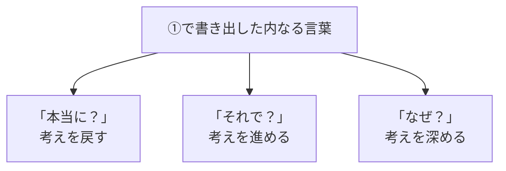

- 図の根拠（キャプション）：連想と深化を促す「T字型思考法」
  - 理由：観点1・2。横（連想）と縦（深化）の可視化。

#### 図：抽象度を上げて考え直す

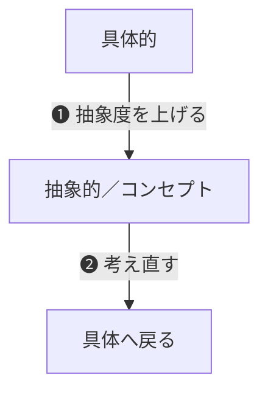

- 図の根拠（キャプション）：❶抽象度を上げて、❷考え直す。
  - 理由：観点1。迷子時の回復手順。

---

### 2-3. 手順③：同じ仲間を分類する 〈グルーピング〉

- 引用：すると、いかに自分が偏った幅の中でしか考えられていないかが目に見えて分かるようになる。
  - 理由：観点1。バイアスの可視化＝解像度診断。

- 引用：①②は自分の内面と向き合うという繊細で主観的な作業であるが、③はできるだけ客観的でなければならない。
  - 理由：観点2。主観工程と客観工程の切り替え。AIに分類を委ねる根拠。

- 引用：方向性を横のライン、深さを縦のラインとすると整理しやすい。
  - 理由：観点1。横＝方向性の幅、縦＝深さ、の定義。

- 引用：分類する、見直す、という作業を３回ほど繰り返すと、ほぼ正しくグルーピングできているようになる。
  - 理由：観点2。反復回数の実務ルール（最低3回）。

- 引用：①②で生まれた紙を並べていくと、自分がどれだけの幅で、どれだけ深く考えているのかを把握できるようになる。この項目を細かくしていくことが、内なる言葉の解像度を高めることにつながるのだ。
  - 理由：観点1。「解像度を高める」の直接定義（幅と深さの細分化）。

**分類の5軸**

- 引用：時間軸……過去のことなのか、現在のことなのか、未来のことなのか
  - 理由：観点1。時間レイヤの分離。
- 引用：人称軸……自分のことなのか、相手・他人のことなのか
  - 理由：観点1。主語の分離。
- 引用：事実軸……本当のことなのか、思い込みなのか
  - 理由：観点1。事実と推測の区別。
- 引用：願望軸……やりたいことなのか、やるべきことなのか
  - 理由：観点1。「何を作るか」を欲望と義務で切り分ける。
- 引用：感情軸……希望なのか、不安なのか
  - 理由：観点1。動機の極性の可視化。

#### 図：横のラインと縦のライン

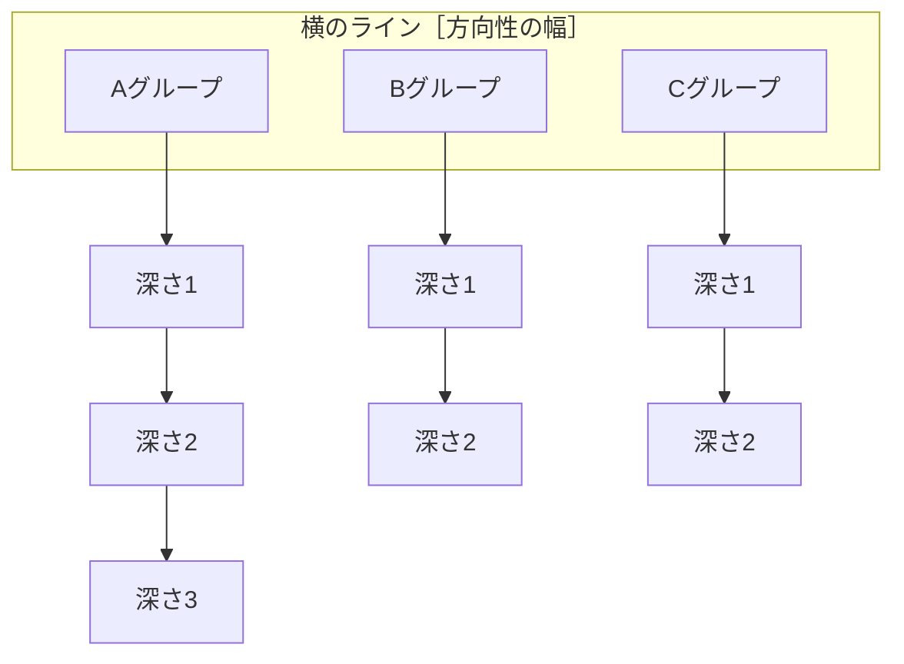

- 図の根拠（キャプション）：横のラインと縦のラインを意識する。
  - 理由：観点1。幅×深さの二次元整理モデル。

---

### 2-4. 手順④：足りない箇所に気付き、埋める 〈視点の拡張〉

- 引用：大事なのは、①〜③を行った上で、足りない部分を埋め、内なる言葉の解像度を上げることである。横と縦のラインを拡充することで、内なる言葉の密度を濃くするのだ。
  - 理由：観点1。解像度＝横縦の拡充と密度。

- 引用：考えを広げることと深めることは、考える行為としては同じように思えるが、考える方向は真逆である。
  - 理由：観点1・2。拡張と深化の混同禁止。

- 引用：そのため、まずは横のラインを拡張させることを優先したほうが得策と言える。
  - 理由：観点2。順序原則：先に幅、後に深さ。

- 引用：重複がなく、漏れもない状態を目指す。
  - 理由：観点1。MECE的到達点。

- 引用：自分の頭の中の解像度が上がってくれば、自ずと外に向かう言葉も明確になっていくものである。
  - 理由：観点1。「何を作るか」は内の解像度の従属変数。

- 引用：横のラインと縦のラインを増やし、頭の中の解像度を高める。
  - 理由：観点1。第2章中核の一行要約。

---

### 2-5. 手順⑤：時間を置いて、きちんと寝かせる 〈客観性の確保〉

- 引用：そして、次に行うことは、何もしないことである。
  - 理由：観点2。「何もしない」を工程として明示する。

- 引用：時間を置くのは、２〜３日程度が目安となろう。
  - 理由：観点2。インキュベーション期間の目安。

- 引用：このように、求めずして思わぬ発見をする能力のことを「セレンディピティ」と呼ぶ。
  - 理由：観点2。寝かせた後の偶然発見を設計に含める。

- 引用：①〜④のプロセスを行った直後だと、まだ頭の中が熱い状態であるため、こうしたブレイクスルーは生まれにくい。
  - 理由：観点2。「熱い直後」は化学反応に不向き。

---

### 2-6. 手順⑥：真逆を考える 〈逆転の発想〉

- 引用：自分の常識は、先入観であると心得る。
  - 理由：観点2。化学反応の前提転換。

- 引用：真逆を考えることは「自分の常識や先入観から抜け出す」ことにつながり、半ば強制的に別の世界へと考えを広げていくことなのである。
  - 理由：観点2。意図的プロンプトで視点を跳ばす技法。

- 引用：できる ⇔ できない／やりたい ⇔ やりたくない／好き ⇔ 無関心 ⇔ 嫌い／強み ⇔ 弱み／賛成 ⇔ 反対
  - 理由：観点1。「何を作るか」の境界を否定形で描く。

- 引用：やりたい ⇔ やらなければならない／希望 ⇔ 不安／本音 ⇔ 建前／仕事 ⇔ 遊び ⇔ 家庭／過去 ⇔ 現在 ⇔ 未来
  - 理由：観点1。意味レイヤの対比でドメインの切り口を増やす。

- 引用：私 ⇔ 相手 ⇔ 第三者／主観 ⇔ 客観／知っている人 ⇔ まだ出会っていない人／ひとりきり ⇔ 大人数／味方 ⇔ 敵
  - 理由：観点1。視点人称の入れ替え。

---

### 2-7. 手順⑦：違う人の視点から考える 〈複眼思考〉

- 引用：あの人だったら、どう考えるだろうか？
  - 理由：観点2。AIへのペルソナ指定の原型。

- 引用：「なぜ買うのか」「なぜ買わないのか」「どこが良かったか」「どこが悪かったか」
  - 理由：観点1。「何を作るか」を消費者視点の4問で検証する。

**六つの壁**

- 引用：常識の壁：自分自身の中にある常識が先入観となって、思考を狭めてしまう。
  - 理由：観点1。ドメイン前提の固定化リスク。
- 引用：仕事モードの壁：「仕事だから」と考えることで、本音が出る余地がなくなる。
  - 理由：観点1。業務モードが「作る理由」を殺す。
- 引用：専門性の壁：つい専門性という武器を用いて、課題を解決しようとしてしまう。
  - 理由：観点1。専門枠だけで解像度が落ちる。
- 引用：時間の壁：時間がなくなることで、焦ってしまい、考えることに集中できなくなる。
  - 理由：観点2。短絡思考のトリガー。
- 引用：前例の壁：過去の経験則から、「おそらくこうなるだろう」と推測してしまう。
  - 理由：観点1。焼き直しで新規課題の解像度が下がる。
- 引用：苦手意識の壁：苦手というレッテルを自分に貼ることで、考えが萎縮する。
  - 理由：観点2。思考停止の自己ラベル。

- 引用：自分という壁を越えるためには、他人の視点から考えることが最も効果的である。
  - 理由：観点2。壁突破の最短手段＝他者視点。

- 引用：自分の可能性を狭めているのは、いつだって自分である。
  - 理由：観点2。章中盤の締め。

#### 図：自分という壁

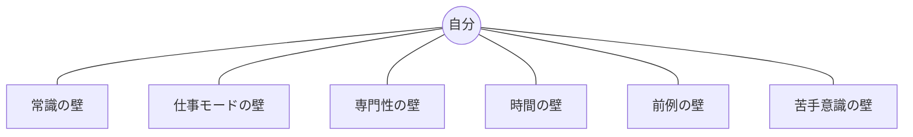

- 図の根拠（キャプション）：自分という壁から、自分自身を解放する。
  - 理由：観点2。思考を狭める内的制約の一覧。

---

### 2-8. 自分との会議の習慣化

- 引用：「時間があったらやる」ということは「時間がなかったらやらない」と同意である。
  - 理由：観点2。受動スケジュールの否定。

- 引用：私の場合、内なる言葉と向き合う時間を「自分との会議時間」と定義し、一週間に数回確保するようにしている。
  - 理由：観点2。運用名と頻度の具体例。AI対話も定例化できる。

- 引用：頭がすっきりした午前中が、最適である。
  - 理由：観点2。時間帯の推奨。

- 引用：「いつか」はいつまでもやってこない。やる気を行動に変える。
  - 理由：観点2。第2章締め。実行に移して初めて効く。

### 第2章メモ（事実と意見の区別）

- **事実（本文に基づく）**: 第2章は思考サイクル（アウトプット→拡散→化学反応）を七つの手順に展開し、A4／付箋、T字型（なぜ／それで／本当に）、横・縦ライン、寝かせ、真逆、複眼、「自分との会議」を具体化する。
- **意見（転用仮説）**: AI対話では、①断片ダンプ → ②三語でT字展開 → ③分類（客観） → ④横の抜け埋め → ⑤冷却 → ⑥反対仮説生成 → ⑦ペルソナレビュー、の順が本書と整合しやすい、と推測されます。
---

## 第3章　プロが行う「言葉にするプロセス」

### 3-1. 素材と調理、2つの戦略

- 引用：本気でものを言うつもりなら、言葉を飾る必要があろうか。（ゲーテ）
  - 理由：観点1。「何を作るか」の芯より装飾に寄る危険を戒めるため。

- 引用：料理で言う素材は「内なる言葉」であり、完成した料理が「外に向かう言葉」。そして、調理がこの章でテーマにしている「言葉にするプロセス」に当たる。
  - 理由：観点1・2。プロダクト定義／プロンプト設計の三層モデル。

- 引用：素材がよければ、味付けは必要最小限でいい。むしろ、よい素材を見極める目利き力こそが、料理人の神髄である。
  - 理由：観点1。表現技法より内なる言葉の質が先。

- 引用：その２つの戦略とは、言葉の型を知ること、言葉を生み出す心構えを持つことである。この両輪を同時に回してこそ、言葉は相手の胸にまっすぐと進んでいく。
  - 理由：観点2。AIでも「型（出力フォーマット）」と「心構え（問い設計・対象具体化）」を両輪で回す。

- 引用：気持ちを整理し、さらけ出す。その熱量に心は動かされる。
  - 理由：観点1。到達点は説明の上手さより熱量（動機）。

#### 図：素材→調理→完成品


#### 図：2つの戦略（両輪）

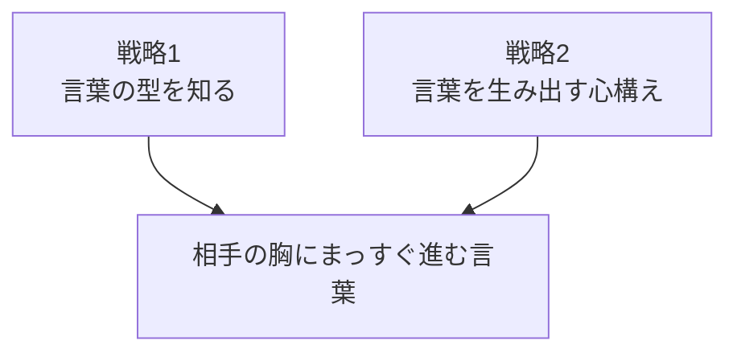

---

## 戦略1　日本語の「型」を知る

**5つの型**: ①たとえる〈比喩・擬人〉／②繰り返す〈反復〉／③ギャップをつくる〈対句〉／④言い切る〈断定〉／⑤感じる言葉を使う〈呼びかけ〉〈誇張・擬態〉

### 型の前提

- 引用：訓練のない個性は、野生に過ぎない。（高田好胤）
  - 理由：観点2。型の訓練なしの「個性っぽさ」だけでは足りない。

- 引用：思いがあるからこそ、型が活きてくる。／その一方で、型を完全に理解したとしても、自分が伝えたい思いがなければ、何の役にも立たず忘れていってしまう。
  - 理由：観点1。テンプレ／プロンプト集だけでドメイン定義が進まない理由。

### ① たとえる〈比喩・擬人〉

- 引用：分かりやすい言葉で、イメージを共有する。
  - 理由：観点1。ドメイン共有＝イメージ共有。

- 引用：得意分野の話にたとえることで、自分の言葉が生まれる。
  - 理由：観点1。自ドメイン語彙でたとえる＝解像度とオリジナリティ。

- 引用：たとえる時は、自分の周りにある言葉を用いること、もしくは、相手が属しているコミュニティで用いている単語を活用することが効果的である。
  - 理由：観点1。説明側／聞き手側どちらの語彙に寄せるかを明示選択する。

- 引用：自分の言葉のタネは、自分の身近に転がっている。
  - 理由：観点2。手元の体験語彙をAI対話の種にする。

### ② 繰り返す〈反復〉

- 引用：大事なことだから、繰り返す。
  - 理由：観点1。「何が大事か」を核フレーズに落とす入口。

- 引用：第2章で自分が伝えたい内容が明確になった時、その思いの全てを込めた単語や短い言葉は何になるだろうか。その言葉さえ見つかれば、反復の型を用いた表現は自ずと生まれるものである。
  - 理由：観点1・2。反復はテク以前に「短い核言葉」の発見が前提。

- 引用：言葉が長くなるほど、意図的に繰り返していることが薄まってしまい、単なる重複と思われてしまう可能性もある。
  - 理由：観点2。AIに反復させるとき「短く・核だけ」の制約が要る。

### ③ ギャップをつくる〈対句〉

- 引用：強い言葉はギャップから生まれる。／常識や現状を否定して、未来を明確に描く。
  - 理由：観点1。「何を捨て、何へ向かうか」を対句で描く。

- 引用：対句のポイントは、自分の言いたいことの逆を前半に入れることで、後半の本当に伝えたい内容を際立たせることにある。
  - 理由：観点1。対句は装飾ではなく輪郭を出すための型。

- 引用：「なぜそこまでこの会社を志望しているのか」「どこに魅力を感じているのか」という根拠がないままでは、言葉が上滑りし、墓穴を掘る。
  - 理由：観点1。熱量の型があっても根拠（ドメイン事実）が無いと空洞化する。

#### 図：対句の踏切台


### ④ 言い切る〈断定〉／旗としての言葉

- 引用：曇りない言葉で、明確な未来を打ち出す。
  - 理由：観点1。「何を作るか」を曖昧語尾で濁さない基準。

- 引用：断言は人々を導く「旗」になる。／「旗」となる言葉が、明確な目的地と方向性を示す。
  - 理由：観点1。旗＝目的地と方向性の言語化。

- 引用：言い切ることは、言い切れるまで考えた結果であり、それがリーダーとしての資質として非常に重要な要素なのだ。
  - 理由：観点2。断言できない＝思考未完了の診断。AI対話の完了条件にもなる。

- 引用：しかし、一つ言えることがある。それは、リーダーシップは常に言葉で発揮されることである。
  - 理由：観点1。施策・機能以前に、言葉で旗を立てる工程が必須。

- 引用：「と思います」が、意志を弱める。／文章を書いた上で「と思う」「と考える」といった言葉を一度排除してみることである。その時に「これはちょっと言い過ぎだな」と感じてしまうのであれば、自分の本気度が足りていない証拠になる。
  - 理由：観点1・2。仕様・方針・プロンプトの曖昧語尾チェック／本気度テスト。

- 引用：断言できるだけあらゆる可能性の幅を検討し、深く考え抜くことがより一層重要になってくるだろう。その意味でも、第3章だけでは不十分で、第2章の正しく考えるプロセスが必要なのだ。
  - 理由：観点2。断言＝第2章の思考深化の結果物、という依存関係。

- 引用：考え抜かれた言葉は、人々を導く旗になる。
  - 理由：観点1。旗の条件は「考え抜かれた」こと。

#### 図：断言→旗

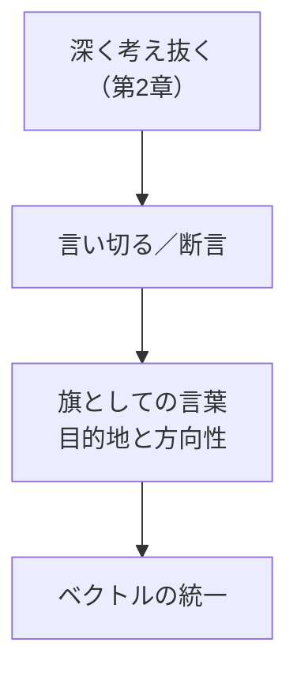

#### 図：「と思います」除去テスト

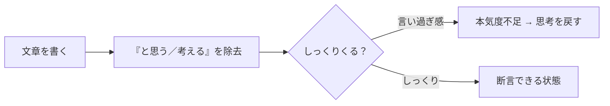

### ⑤ 感じる言葉を使う／話すように書く

- 引用：「感じる言葉」が聞く耳を持たせる。
  - 理由：観点1。伝わらない原因を内容不足だけでなく「聞く耳」未起動と切り分ける。

- 引用：このような状況を回避するために「話すように書く」ことが有効である。
  - 理由：観点2。固い文章＝思考硬直のサイン。

- 引用：スマートフォンや携帯電話のボイスレコーダー機能などを用いて、文章にしたいことを相手を想定しながら口にしてみるといい。話す相手をできるだけ具体的に想定したほうが臨場感のある言葉が生まれていく。
  - 理由：観点1・2。具体的な相手想定→発話→文字起こし、の実務手順。

### 戦略1メモ（事実と意見の区別）

- **事実（本文に基づく）**: 戦略1は比喩・反復・対句・断定・感じる言葉の5型で、思いを外に向かう言葉へ変換する。
- **意見（転用仮説）**: AIには「核の短句を先に出す→対句で輪郭→断言形で旗立て→音読チェック」の順が整合しやすい、と推測されます。
---

## 戦略2　言葉を生み出す「心構え」を持つ

**7つの心構え**: ①ターゲティング／②常套句を排除／③一文字でも減らす〈先鋭化〉／④口にしてリズム確認／⑤動詞にこだわる／⑥新しい文脈をつくる〈意味の発明〉／⑦似て非なる言葉を区別する〈意味の解像度〉

### 導入

- 引用：内なる言葉を強く意識し、拡散することで解像度を上げる。そして、言葉の型を知ることで、自分の思いを外に向かう言葉へと変化させていく。
  - 理由：観点1・2。第1–2章＋戦略1を踏まえた全体パイプラインの要約。

- 引用：言葉は自分の思いを伝えるための手段であり、伝えるべき自分の思いを把握し、大きく育てていくことが重要である。
  - 理由：観点1。「何を作るか」＝伝えるべき思いの把握と育成。

### ① たった1人に伝わればいい〈ターゲティング〉

- 引用：みんなに伝えようとすると、誰にも伝わらない。
  - 理由：観点1。ペルソナを平均化すると要件がぼやける。

- 引用：「日本人全員に伝わるようにしよう」「30〜40代の全ての女性から共感を得られるようにしよう」と考えて言葉を生み出したところで、いい結果を得ることはできない。むしろ、より多くの人に伝えようと思えば思うほど、誰の琴線にも触れることのない言葉になっていく傾向がある。
  - 理由：観点1。広すぎるターゲット定義の失敗モード。

- 引用：1人に伝われば、みんなに伝わる。
  - 理由：観点1。「何を作るか」の判定基準を1人の顔に落とす。

- 引用：言葉の前に「あなたに伝えたいことがある」という文節を付けてみて、違和感や照れを感じないかを確かめることである。
  - 理由：観点1・2。メッセージ監査チェックリスト。

- 引用：誰１人として、平均的な人などいない。顔を思い浮かべ反応を予測する。
  - 理由：観点2。AIに「平均ユーザー」ではなく具体人物でレビューさせる。

#### 図：「あなたに伝えたいことがある」分解

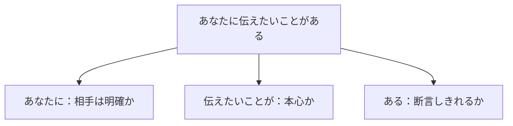

### ② 常套句を排除する

- 引用：常套句が「あなたらしさ」を奪っている。
  - 理由：観点1・2。汎用テンプレ／汎用AI出力がドメイン固有性を削ぐ。

- 引用：無意識のうちに使ってしまっている常套句や紋切り型の言葉を意識して排除し、当事者同士だけが理解できる言葉に置き換えていくだけで、コミュニケーションは円滑になり、相手との間合いを詰めることができるようになる。
  - 理由：観点1。共有エピソード固有語＝解像度の高い指示語。

### ③ 一文字でも減らす〈先鋭化〉

- 引用：書ききる。そして、修正を加える。
  - 理由：観点2。発散と収束の分離。

- 引用：専門用語や完全に理解していない言葉を使わない。
  - 理由：観点1。用語を噛み砕けない＝ドメイン理解不足の検知器。

- 引用：文章を書いていくことは、書くことと消すことを繰り返していく作業である。
  - 理由：観点2。AI対話の「生成→削除→再生成」を正規工程とみなす。

- 引用：そのためには２つの条件があり、まずは、書こうと思っていることの設計図が頭の中にあること。そして、いざ「書こう」と思い立った後は、内なる言葉が溢れてくる思考の早さに取り残されないように書き続けることである。
  - 理由：観点2。設計図と一気書きの二条件。

- 引用：大事なのは、伝えたいと思っていることが含まれているか、「言葉で表現できているか」である。どんなに言葉が美しく読みやすいものであったとしても、肝心の内容がなければ、文章ではなく、ただの文字列でしかない。
  - 理由：観点1。見た目の整ったアウトプットと中身を分離して評価する。

- 引用：推敲というと、文章を書き直しながら磨いていく、という印象があるかもしれないが、私は文書の余計なぜい肉をそぎ落とすことで、核心を絞り込んでいく作業と捉えている。
  - 理由：観点1。推敲＝核心の絞り込み。

- 引用：言葉にまつわる誤解として最も多いのが、できるだけ丁寧に説明をしたほうが理解が進むであろう、というものがある。しかし実際には、詳しく説明されるほど分からなくなってしまうことが起こり得る。情報過多によって、思考が止まってしまっている状態である。
  - 理由：観点1・2。要件・仕様・AI回答の情報過多が解像度を下げる。

#### 図：先鋭化プロセス

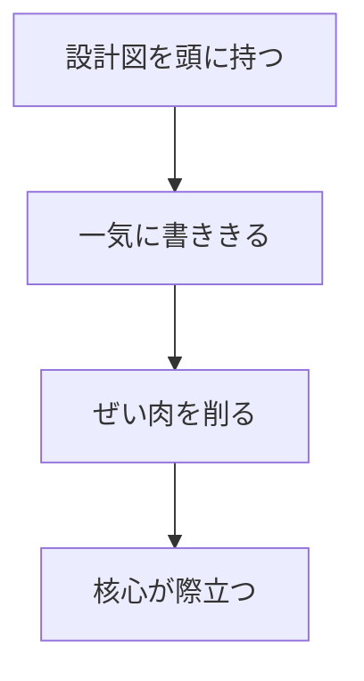

### ④ きちんと書いて口にする〈リズム〉

- 引用：誰もが、文章を「内なる言葉」で読んでいる。
  - 理由：観点2。読み手の内なる言葉＝摩擦検知の対象。

- 引用：一度書いてみた言葉や文章を口に出して読んでみることである。／読みにくい言葉は、心に入ってこない。
  - 理由：観点1・2。論理OKでも読みにくい箇所は心が入らない。

### ⑤ 動詞にこだわる〈躍動感〉

- 引用：動詞には意志が宿る。
  - 理由：観点1。「何をするか」は動詞で決まる。

- 引用：実体験が内なる言葉の動詞を増やす。／体験の幅を広げることが、動詞の幅を広げることにつながる。
  - 理由：観点1。ドメイン解像度は語彙暗記より体験由来の動詞ストックで上がる。

- 引用：多くの言葉を知っていたり、辞書に載っている正しい意味を知っていても、自分がどんな時にその言葉を使うべきかを理解していなければ意味がない。
  - 理由：観点1。知識≠運用可能知識。

### ⑥ 新しい文脈をつくる〈意味の発明〉

- 引用：「○○って、△△だ。」で、新しい名前を付ける。
  - 理由：観点1・2。概念再定義の型。AIに対比・再命名をさせるプロンプト核。

- 引用：中に入れる２つの言葉は、できるだけ真逆の意味を持っている言葉のほうが効果を発揮する。
  - 理由：観点2。命名法の具体ルール（対立ペア）。

- 引用：名前が変われば、意識が変わる。常識が変わる。
  - 理由：観点1。命名＝組織・役割の解像度と行動規範の書き換え。

- 引用：ビジネスにおいて言えば、クライアントや協力会社のことを、同じプロジェクトを推進するパートナーと定義し直すことも、同様の効果を生むことにつながる。
  - 理由：観点1。ステークホルダー定義の実務転用。

#### 図：命名法

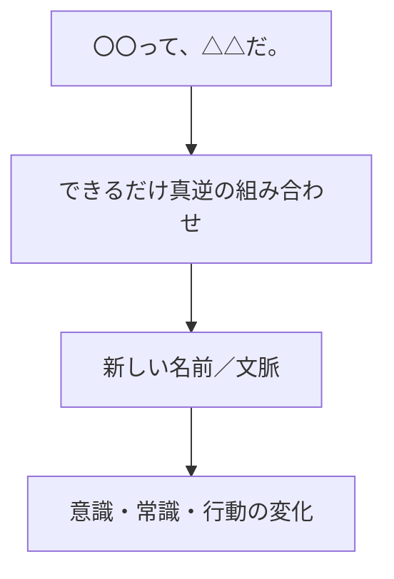

### ⑦ 似て非なる言葉を区別する〈意味の解像度〉

- 引用：単純化することで失われるものがある。
  - 理由：観点1。要約しすぎると固有の「作るもの」が消える。

- 引用：知識は知っている状態を指し、知恵は自分のものとして使えるものを指す。
  - 理由：観点1。ドメイン「知ってる」と「使える」の分離。

- 引用：問題は既に起きてしまった状態であり、課題はその問題を引き起こし続ける本当の原因である。問題に目を奪われることなく、課題を探る必要がある。
  - 理由：観点1。「何を作るか」＝課題側に置く。

- 引用：解消はマイナスをゼロにするものであり、解決はマイナスをプラスに変換するものである。
  - 理由：観点1。成果定義（ゼロ戻し vs プラス化）の解像度。

- 引用：顧客は仕事上の取引先や生活者の集団であり、個客はその１人ひとり。
  - 理由：観点1。ターゲティングと同型の語彙区別。

- 引用：重要なのは、自分だけの似て非なる言葉リストを作成することである。……それらが積み重なっていくことで、自分が大事にしている価値観が自然と浮き彫りになっていく。そして、内なる言葉の語彙力も解像度も高まっていき、考えが深まっていく。
  - 理由：観点1・2。継続的な解像度向上の習慣。AIに差分定義を手伝わせられる。

#### 図：似て非なる言葉リスト（抜粋）

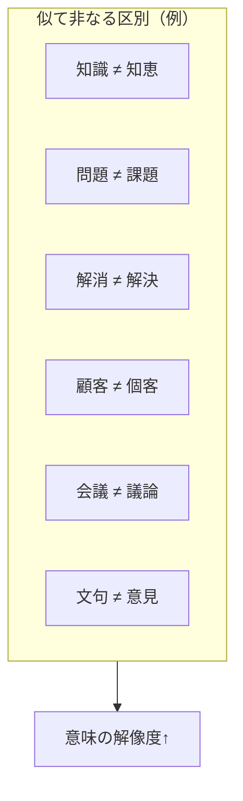

### 戦略2メモ（事実と意見の区別）

- **事実（本文に基づく）**: 戦略2はターゲティング、常套句排除、先鋭化、リズム、動詞、命名法、似て非なる区別の7心構えで構成される。
- **意見（転用仮説）**: AI運用では、①1人の顔を決める → ②書ききる → ③削る → ④専門用語を噛み砕く → ⑤音読または「似て非なる区別」でレビュー、の順が整合しやすい、と推測されます。

---

## おわりに

- 引用：言葉を生み出すために必要なのは、動機である。
  - 理由：観点1。型より先に動機（なぜ作るか）。

- 引用：動機が大きければ大きいほど、伝えなければならないという使命感が強いほど、自分の考えていることを正確に、そして、余すことなく言葉にしようとする作用が働く。
  - 理由：観点2。動機が思考と表現のエンジンである、という因果。

- 引用：言葉にできないということは、言葉にできるだけ考えられていないことと同じである。
  - 理由：観点1・2。言語化不能＝思考未完了の診断（第1章との呼応）。

- 引用：そのため、言葉にできるだけ考えを進める思考法から提示しなければ、目的を達成することはできない。
  - 理由：観点2。スキル列挙ではなく思考法が本体、という本書の結論。

- 引用：もちろん、その内容はスキルやテクニックといった表現技法の色列であってはならない。……「モノは言いよう」で自分を大きく見せたり、相手から評価を得ようとしても意味がないからである。
  - 理由：観点1。表現テク偏重への最終警告。

---

## 全体メモ（転用仮説）

本書全体を、観点1・2に沿って運用する場合の仮説手順です（本文の断定ではなく転用意見）。

```mermaid
flowchart TD
  A["① 内なる言葉を断片で書き出す"] --> B["② T字型でなぜ／それで／本当に"]
  B --> C["③ 横ライン・縦ラインで分類と拡張"]
  C --> D["④ 寝かせる → 真逆・複眼で化学反応"]
  D --> E["⑤ 1人の顔に向けて型で変換<br/>（比喩／対句／断言／核の短句）"]
  E --> F["⑥ 削る・動詞・似て非なる区別で先鋭化"]
  F --> G["⑦ 旗として言い切れるか／動きたくなる空気か"]
```

---

## 進行状況

- [x] 第1章
- [x] 第2章
- [x] 第3章
- [x] 戦略1
- [x] 戦略2
- [x] おわりに

全章の引用抽出を完了しました。
